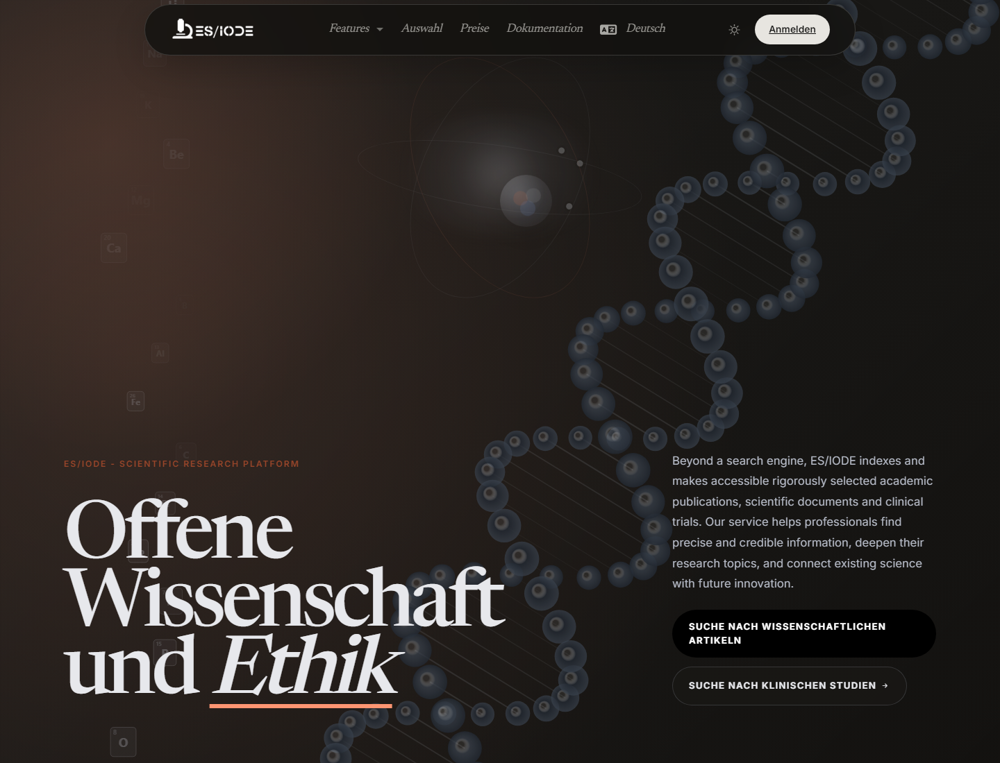
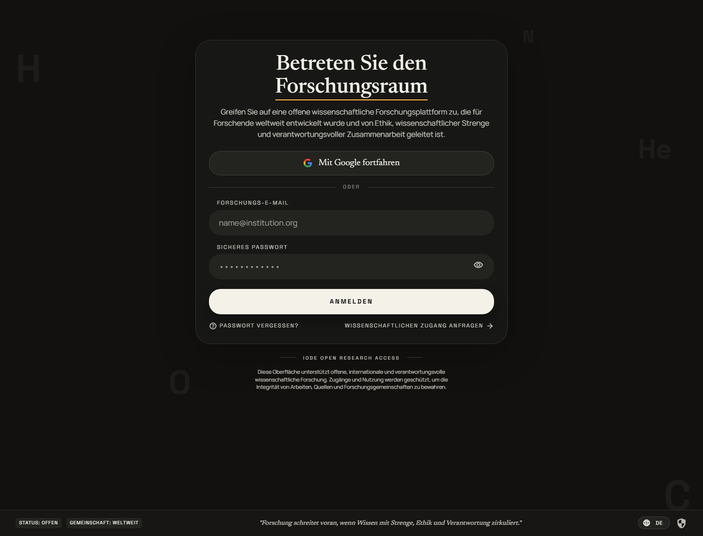

# Willkommen bei **ES/IODE**

[](changelog.md)
[](https://learn.microsoft.com/dotnet/)

[](https://ethicseido.com/Iode/Iode)

## Überblick

**ES/IODE** ist ein Online-Dienst für wissenschaftliche Recherche. Die Plattform bündelt Werkzeuge für die Suche nach wissenschaftlichen Artikeln, die Recherche klinischer Studien, wissenschaftliche Nachrichten, ein tägliches Wissenschaftsjournal und die Schreibvorbereitung mit **SciScholarCraft**.

Die Plattform verbindet geprüfte wissenschaftliche Quellen mit KI-, Übersetzungs-, Recherche- und Synthesefunktionen. Öffentliche Funktionen sind über das Menü **Features** der Website erreichbar. Einige erweiterte Aktionen erfordern ein Konto oder das Academic-Angebot.



## Hauptfunktionen

- **Artikelsuche**: Publikationen suchen, Dokumentdetails öffnen und den KI-Assistenten nutzen, wenn die Option verfügbar ist.
- **Suche nach klinischen Studien**: klinische Studien anhand von Schlüsselwörtern finden und Ergebnisse mit dem KI-Assistenten vertiefen.
- **SciScholarCraft**: ein Forschungsziel analysieren, Hypothesen erzeugen, Studien auswählen und einen Schreibplan erstellen.
- **Wissenschaftsbild**: die öffentliche visuelle Funktion nutzen, wenn sie im Website-Menü verfügbar ist.
- **Wissenschaftsnachrichten**: kuratierte Nachrichten aus externen wissenschaftlichen Quellen lesen.
- **Wissenschaftsjournal**: die tägliche Auswahl wissenschaftlicher Studien von ES/IODE durchsehen.

## Dienste aufrufen

```text
Wissenschaftliche Artikel: https://ethicseido.com/Iode/Search
Klinische Studien: https://ethicseido.com/Iode/SearchClinicalTrial
SciScholarCraft: https://ethicseido.com/Iode/SciScholarCraft
Wissenschaftsnachrichten: https://ethicseido.com/Iode/ScienceNews
Wissenschaftsjournal: https://ethicseido.com/en/Iode/Selection
Servicestatus: https://esiode.statuspage.io/
```

## Anmelden

Klicken Sie in der Navigationsleiste auf **Sign in**, um den Anmeldebildschirm zu öffnen. Dort können Sie Ihre Zugangsdaten eingeben oder die Registrierung starten.



Wenn Sie bereits ein Konto haben, melden Sie sich mit Ihren Zugangsdaten an. Andernfalls nutzen Sie die Registrierung der Plattform. Nutzungslimits und Academic-Funktionen hängen vom aktiven Angebot ab.
