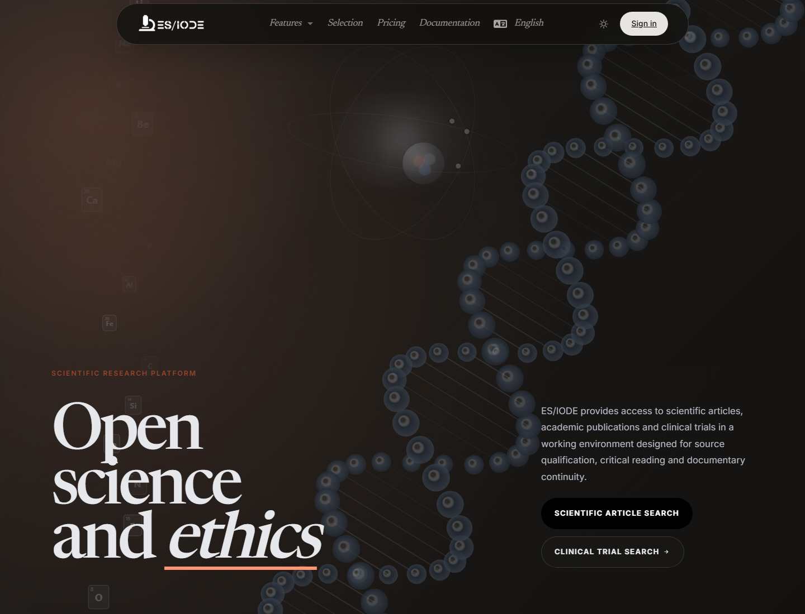
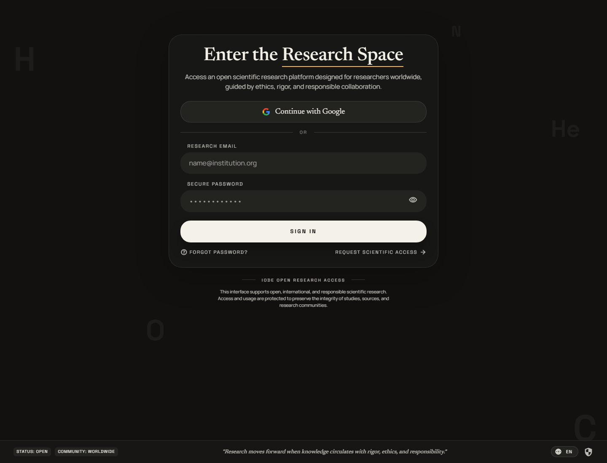

---
description: Start using the ES/IODE scientific research service
icon: simple/readthedocs
---
# Welcome to **ES/IODE**

[](changelog.md)
[](https://learn.microsoft.com/dotnet/)

[](https://ethicseido.com/Iode/Iode)

## Overview

**ES/IODE** is an online service for scientific research. It brings together tools for searching scientific articles, exploring clinical trials, following scientific news, reading a daily scientific journal, and preparing scientific writing with **SciScholarCraft**.

The platform combines verified scientific sources with AI, translation, research assistance, and synthesis features. Public features are available from the site's **Features** menu. Some advanced actions require an account or the Academic offer.



## Main features

- **Scientific articles search**: search publications, open document details, and use the AI assistant when the option is available.
- **Clinical trials search**: find clinical trials from keywords and deepen results with the AI assistant.
- **SciScholarCraft**: analyze a research objective, generate hypotheses, select studies, and produce a writing plan.
- **Science picture**: access the public visual feature when it is available from the site menu.
- **Scientific news**: read curated news from external scientific sources.
- **Scientific journal**: browse ES/IODE's daily selection of scientific studies.

## Access the services

```text
Scientific articles: https://ethicseido.com/Iode/Search
Clinical trials: https://ethicseido.com/Iode/SearchClinicalTrial
SciScholarCraft: https://ethicseido.com/Iode/SciScholarCraft
Scientific news: https://ethicseido.com/Iode/ScienceNews
Scientific journal: https://ethicseido.com/en/Iode/Selection
Service status: https://esiode.statuspage.io/
```

## Sign in

Click **Sign in** in the navigation bar to open the login screen. The login screen then lets you enter your credentials or open the registration flow.



If you already have an account, sign in with your credentials. Otherwise, use the registration flow provided by the platform. Usage limits and Academic features depend on the active offer.
