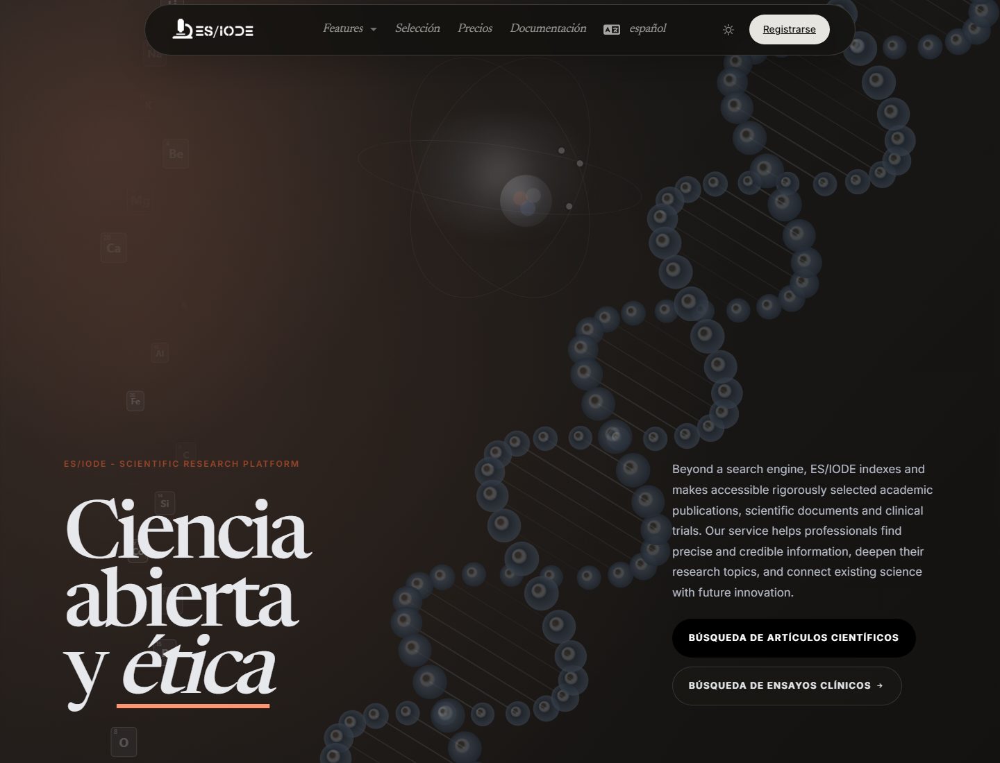
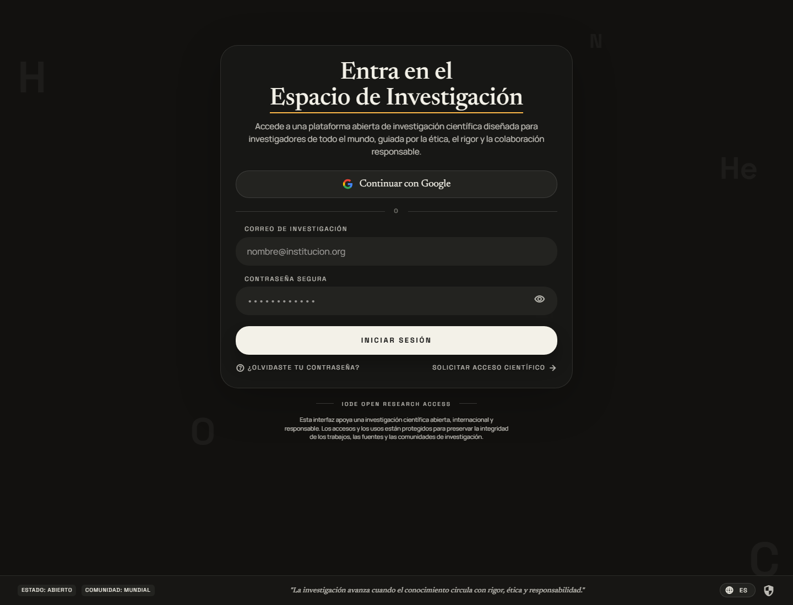

# Bienvenido a **ES/IODE**

[](changelog.md)
[](https://learn.microsoft.com/dotnet/)

[](https://ethicseido.com/Iode/Iode)

## Descripción general

**ES/IODE** es un servicio en línea para la investigación científica. Reúne herramientas para buscar artículos científicos, explorar ensayos clínicos, seguir noticias científicas, consultar una revista científica diaria y preparar escritura científica con **SciScholarCraft**.

La plataforma combina fuentes científicas verificadas con funciones de IA, traducción, asistencia de investigación y síntesis. Las funciones públicas están disponibles desde el menú **Features** del sitio. Algunas acciones avanzadas requieren una cuenta o la oferta Academic.



## Funciones principales

- **Búsqueda de artículos científicos**: buscar publicaciones, abrir detalles de documentos y usar el asistente de IA cuando esté disponible.
- **Búsqueda de ensayos clínicos**: encontrar ensayos clínicos por palabras clave y profundizar los resultados con el asistente de IA.
- **SciScholarCraft**: analizar un objetivo de investigación, generar hipótesis, seleccionar estudios y producir un plan de escritura.
- **Imagen científica**: acceder a la función visual pública cuando esté disponible desde el menú del sitio.
- **Noticias científicas**: leer noticias seleccionadas de fuentes científicas externas.
- **Revista científica**: explorar la selección diaria de estudios científicos de ES/IODE.

## Acceder a los servicios

```text
Artículos científicos: https://ethicseido.com/Iode/Search
Ensayos clínicos: https://ethicseido.com/Iode/SearchClinicalTrial
SciScholarCraft: https://ethicseido.com/Iode/SciScholarCraft
Noticias científicas: https://ethicseido.com/Iode/ScienceNews
Revista científica: https://ethicseido.com/en/Iode/Selection
Estado del servicio: https://esiode.statuspage.io/
```

## Iniciar sesión

Haz clic en **Sign in** en la barra de navegación para abrir la pantalla de inicio de sesión. Desde esa pantalla puedes introducir tus credenciales o abrir el registro.



Si ya tienes una cuenta, inicia sesión con tus credenciales. Si no, utiliza el registro ofrecido por la plataforma. Los límites de uso y las funciones Academic dependen de la oferta activa.
