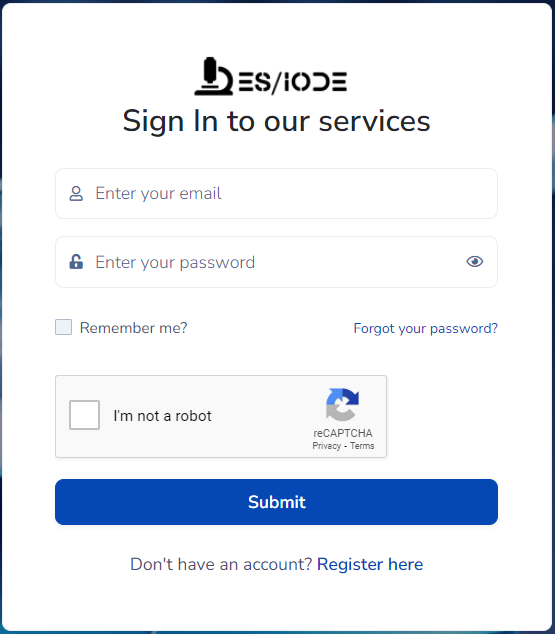

# Bienvenido a ES/IODE: Tu servicio confiable de investigación científica en línea

[](changelog.md)
[](https://learn.microsoft.com/dotnet/)

[](https://ethicseido.com/Iode/Iode)


## **Introducción**

__ES/IODE__ es un servicio en línea de investigación científica que te brinda acceso a una vasta colección de documentos científicos de alta calidad. Ofrecemos 2 motores de búsqueda específicos, uno especializado en la búsqueda de estudios científicos y el otro especializado en la búsqueda de ensayos clínicos.
Nuestro servicio está diseñado:

- para simplificar tu búsqueda de publicaciones académicas, documentos científicos y ensayos clínicos
- para ayudarte a encontrar información precisa y creíble para tus necesidades de investigación.
- para ayudarte a profundizar en tus temas de investigación.

También ofrecemos __SciScholarCraft__, tu compañero inteligente para la escritura científica. Nuestra herramienta avanzada simplifica tu experiencia, creando un plan de investigación estratégico, ofreciendo sugerencias relevantes y asegurando una escritura fluida. Desbloquea el potencial de tus ideas y sumérgete en el futuro de la escritura científica.

## **¿Por qué elegir ES/IODE?**

<!-- ### Búsqueda Avanzada
__ES/IODE__ ofrece capacidades de búsqueda avanzada que te permiten especificar tus criterios de búsqueda para obtener resultados específicos. Puedes filtrar por campo, fecha, autores, palabras clave y mucho más. Esto asegura que obtengas resultados relevantes para tu tema. -->

### Confianza en la Fuente
Nos comprometemos a proporcionar estudios científicos y ensayos clínicos de fuentes confiables y verificadas. Nuestra base de datos se actualiza continuamente para brindarte la información más reciente y precisa.

### Fácil de Usar
__ES/IODE__ está diseñado para ser fácil de usar. No necesitas ser un experto en investigación académica para encontrar los estudios que necesitas. Nuestra interfaz intuitiva te permite navegar fácilmente por nuestra colección.

### Innovación
__ES/IODE__ está en constante evolución para ofrecer a sus usuarios una experiencia de investigación científica de vanguardia. Nuestro motor de búsqueda incorpora tecnologías avanzadas como __GenAI__ (Inteligencia Artificial Generativa), __Text-to-Speech__, __Traducción de Aprendizaje Profundo__, __LLM__ (Modelo de Lenguaje Grande) y __Procesamiento de Lenguaje Natural__ (__NLP__). Estas características innovadoras permiten a los investigadores y entusiastas de la ciencia acceder a un mundo de información con una facilidad y precisión sin precedentes.

Pero nuestro compromiso con la innovación no se detiene ahí. Estamos decididos a mantener un enfoque ético en el desarrollo de nuestras futuras características. Nuestra meta es proporcionar herramientas de investigación cada vez más avanzadas, respetando la privacidad de los datos, la transparencia y la ética. Con __ES/IODE__, la innovación y la ética van de la mano para ofrecer una experiencia de investigación científica que satisfaga las necesidades de la comunidad y al mismo tiempo mantenga los valores fundamentales de la integridad científica.

## **¿Cómo acceder al motor de búsqueda científica de ES/IODE?**

En tu navegador de internet favorito (chrome, brave, edge, firefox...), utiliza el siguiente enlace para acceder a __ES/IODE__:


```
https://ethicseido.com/Iode/Search
```


## **¿Cómo acceder al motor de búsqueda de ensayos clínicos de ES/IODE?**

En tu navegador de internet favorito (chrome, brave, edge, firefox...), utiliza el siguiente enlace para acceder a __ES/IODE__:


```
https://ethicseido.com/Iode/SearchClinicalTrial
```

## **¿Cómo acceder a ES/IODE SciScholarCraft?**

En tu navegador de internet favorito (chrome, brave, edge, firefox...), utiliza el siguiente enlace para acceder a __ES/IODE__:


```
https://ethicseido.com/Iode/SciScholarCraft
```


## **¿Cómo iniciar sesión en ES/IODE?**

Para iniciar sesión, haz clic en el botón "Iniciar sesión" en la barra de navegación


Luego serás dirigido a la pantalla de inicio de sesión.



Si ya tienes una cuenta, completa la información e inicia sesión. De lo contrario, haz clic en "Registrarse aquí" y sigue las instrucciones en pantalla.