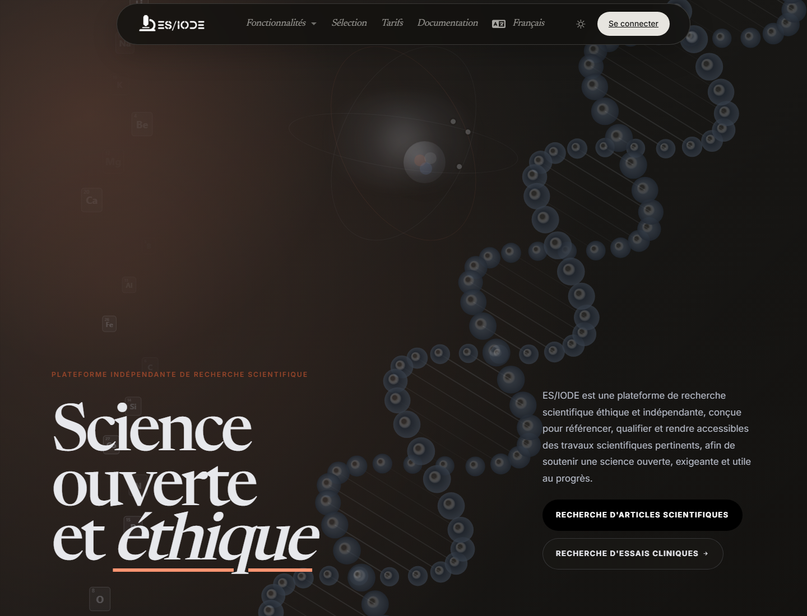
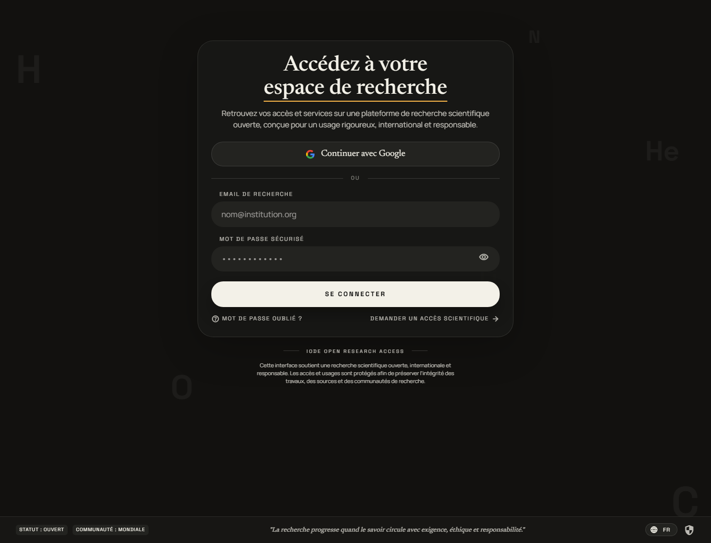

# Bienvenue sur **ES/IODE**

[](changelog.md)
[](https://learn.microsoft.com/dotnet/)

[](https://ethicseido.com/Iode/Iode)

## Présentation

**ES/IODE** est un service en ligne dédié à la recherche scientifique. Il regroupe des outils pour rechercher des articles, explorer des essais cliniques, suivre l'actualité scientifique, consulter une revue scientifique quotidienne et préparer un travail de rédaction scientifique avec **SciScholarCraft**.

La plateforme combine des sources scientifiques vérifiées avec des fonctionnalités d'IA, de traduction, d'assistance à la recherche et de synthèse. Les fonctionnalités publiques sont accessibles depuis le menu **Features** du site. Certaines actions avancées nécessitent une connexion ou une offre Academic.



## Fonctionnalités principales

- **Recherche d'articles scientifiques** : rechercher des publications, consulter les détails d'un document et utiliser l'assistant IA lorsque l'option est disponible.
- **Recherche d'essais cliniques** : trouver des essais cliniques à partir de mots-clés et approfondir les résultats avec l'assistant IA.
- **SciScholarCraft** : analyser un objectif de recherche, générer des hypothèses, sélectionner des études et produire un plan d'écriture.
- **Image de science** : accéder à la fonctionnalité visuelle publique lorsqu'elle est disponible depuis le menu du site.
- **Actualités scientifiques** : consulter une sélection d'actualités issues de sources scientifiques externes.
- **Revue scientifique** : parcourir la sélection quotidienne d'études mise en avant par ES/IODE.

## Accéder aux services

```text
Recherche d'articles: https://ethicseido.com/Iode/Search
Recherche d'essais cliniques: https://ethicseido.com/Iode/SearchClinicalTrial
SciScholarCraft: https://ethicseido.com/Iode/SciScholarCraft
Actualités scientifiques: https://ethicseido.com/Iode/ScienceNews
Revue scientifique: https://ethicseido.com/en/Iode/Selection
Statut du service: https://esiode.statuspage.io/
```

## Connexion

Cliquez sur **Sign in** dans la barre de navigation pour accéder à l'écran de connexion. L'écran de connexion permet ensuite de saisir vos identifiants ou d'ouvrir le parcours d'inscription.



Si vous avez déjà un compte, connectez-vous avec vos identifiants. Sinon, utilisez l'inscription proposée par la plateforme. Les limites d'usage et les fonctionnalités Academic dépendent de l'offre active.
