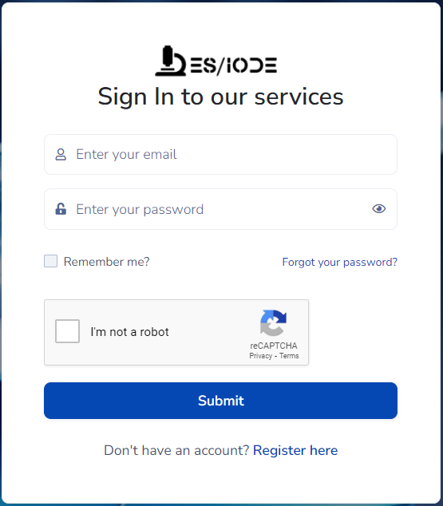

# Welkom bij ES/IODE: Uw betrouwbare online wetenschappelijke onderzoeksservice

[](changelog.md)
[](https://learn.microsoft.com/dotnet/)

[](https://ethicseido.com/Iode/Iode)


## **Inleiding**

__ES/IODE__ is een online wetenschappelijke onderzoeksservice die u toegang geeft tot een uitgebreide verzameling hoogwaardige wetenschappelijke documenten. We bieden 2 specifieke zoekmachines aan, één gespecialiseerd in het zoeken naar wetenschappelijke studies, de andere gespecialiseerd in het zoeken naar klinische proeven.
Onze service is ontworpen:

- om uw zoektocht naar academische publicaties, wetenschappelijke documenten en klinische proeven te vereenvoudigen
- om u te helpen nauwkeurige en geloofwaardige informatie te vinden voor uw onderzoeksbehoeften.
- om u te helpen uw onderzoeksonderwerpen te verdiepen.

We bieden ook __SciScholarCraft__, uw slimme partner voor wetenschappelijk schrijven. Onze geavanceerde tool vereenvoudigt uw ervaring, maakt een strategisch onderzoeksplan, biedt relevante suggesties en zorgt voor soepel schrijven. Ontgrendel het potentieel van uw ideeën en duik in de toekomst van wetenschappelijk schrijven

## **Waarom kiezen voor ES/IODE?**

<!-- ### Geavanceerd Zoeken
__ES/IODE__ biedt geavanceerde zoekmogelijkheden waarmee u uw zoekcriteria kunt specificeren om specifieke resultaten te verkrijgen. U kunt filteren op vakgebied, datum, auteurs, trefwoorden en nog veel meer. Dit zorgt ervoor dat u relevante resultaten krijgt voor uw onderwerp. -->

### Betrouwbaarheid van Bronnen
We zijn toegewijd aan het verstrekken van wetenschappelijke studies en klinische proeven uit betrouwbare en geverifieerde bronnen. Onze database wordt voortdurend bijgewerkt om u de nieuwste en meest nauwkeurige informatie te bieden.

### Gebruiksvriendelijk
__ES/IODE__ is ontworpen om gebruiksvriendelijk te zijn. U hoeft geen expert te zijn in academisch onderzoek om de studies te vinden die u nodig heeft. Onze intuïtieve interface stelt u in staat om gemakkelijk door onze collectie te navigeren.

### Innovatie
__ES/IODE__ evolueert voortdurend om gebruikers een geavanceerde wetenschappelijke onderzoekservaring te bieden. Onze zoekmachine integreert geavanceerde technologieën zoals __GenAI__ (Generatieve AI), __Text-to-Speech__, __Vertaal Deep Learning__, __LLM__ (Groot Taalmodel) en __NLP__ (Natuurlijke Taalverwerking). Deze baanbrekende functies stellen onderzoekers en wetenschapsenthousiastelingen in staat toegang te krijgen tot een wereld van informatie met ongeëvenaard gemak en precisie.

Maar onze toewijding aan innovatie houdt daar niet op. We zijn vastbesloten om een ethische benadering te handhaven bij de ontwikkeling van onze toekomstige functies. Ons doel is om steeds geavanceerdere onderzoekstools te bieden, met respect voor gegevensprivacy, transparantie en ethiek. Met __ES/IODE__ gaan innovatie en ethiek hand in hand om een wetenschappelijke onderzoekservaring te bieden die aan de behoeften van de gemeenschap voldoet en tegelijkertijd de fundamentele waarden van wetenschappelijke integriteit hoog houdt.

## **Hoe toegang krijgen tot de ES/IODE wetenschappelijke zoekmachine?**

In uw favoriete internetbrowser (chrome, brave, edge, firefox...), gebruikt u de volgende link om toegang te krijgen tot __ES/IODE__:

```
https://ethicseido.com/Iode/Search
```


## **Hoe toegang krijgen tot de ES/IODE klinische proef zoekmachine?**

In uw favoriete internetbrowser (chrome, brave, edge, firefox...), gebruikt u de volgende link om toegang te krijgen tot __ES/IODE__:


```
https://ethicseido.com/Iode/SearchClinicalTrial
```


## **Hoe toegang krijgen tot de ES/IODE SciScholarCraft?**

In uw favoriete internetbrowser (chrome, brave, edge, firefox...), gebruikt u de volgende link om toegang te krijgen tot __ES/IODE__:


```
https://ethicseido.com/Iode/SciScholarCraft
```


## **Hoe in te loggen bij ES/IODE?**

Om in te loggen, klikt u op de knop "Aanmelden" in de navigatiebalk


Vervolgens wordt u naar het inlogscherm geleid.



Als u een account heeft, vult u de informatie in en logt u in. Klik anders op "Registreer hier" en volg de instructies op het scherm.
