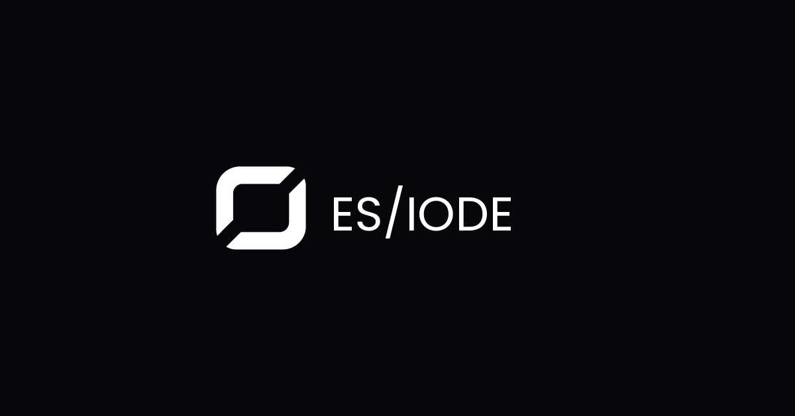
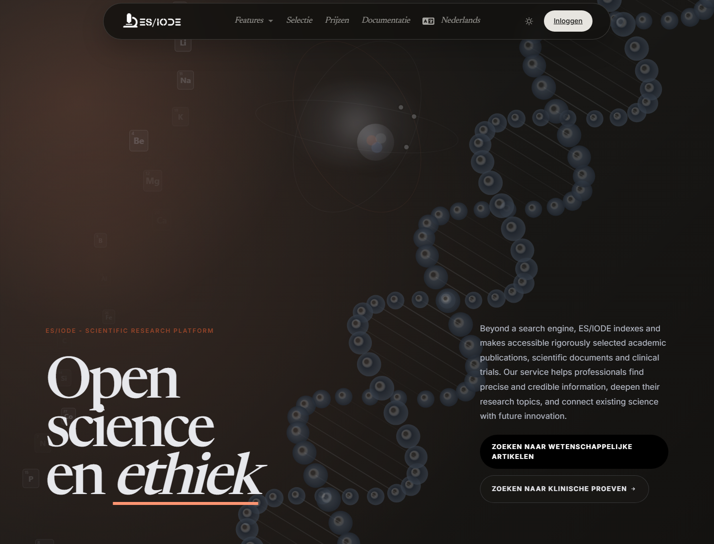
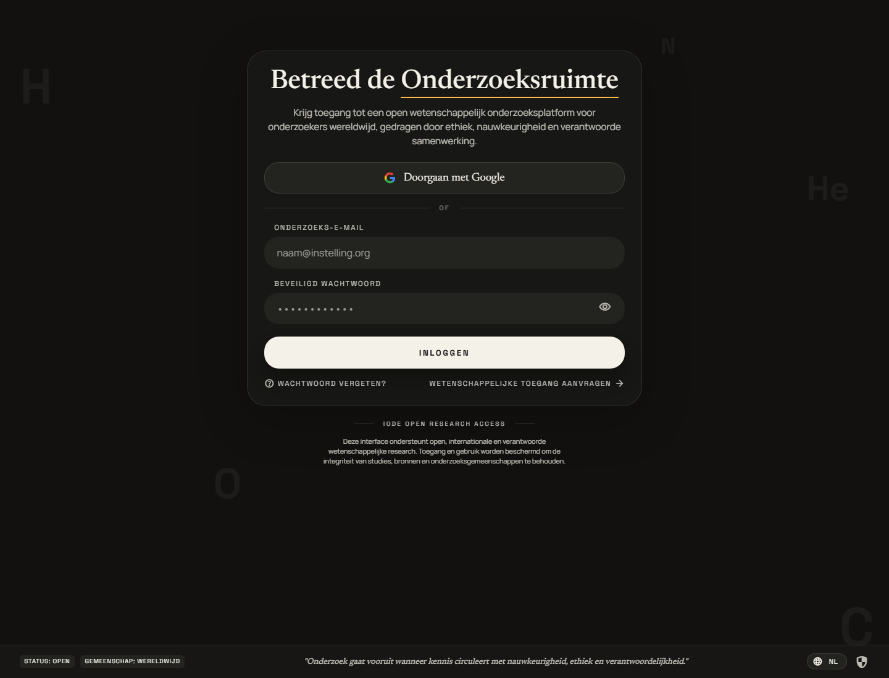

---
description: Aan de slag met de wetenschappelijke onderzoeksdienst ES/IODE
icon: simple/readthedocs
---
# Welkom bij **ES/IODE**

[](changelog.md)
[](https://learn.microsoft.com/dotnet/)

[](https://ethicseido.com/Iode/Iode)

## Overzicht

**ES/IODE** is een online dienst voor wetenschappelijk onderzoek. Het platform bundelt hulpmiddelen voor het zoeken naar wetenschappelijke artikelen, het verkennen van klinische onderzoeken, het volgen van wetenschapsnieuws, het lezen van een dagelijks wetenschappelijk tijdschrift en het voorbereiden van wetenschappelijk schrijven met **SciScholarCraft**.

Het platform combineert geverifieerde wetenschappelijke bronnen met AI, vertaling, onderzoeksondersteuning en samenvatting. Openbare functies zijn beschikbaar via het menu **Features** van de site. Sommige geavanceerde acties vereisen een account of het Academic-aanbod.



## Belangrijkste functies

- **Zoeken naar wetenschappelijke artikelen**: publicaties zoeken, documentdetails openen en de AI-assistent gebruiken wanneer de optie beschikbaar is.
- **Zoeken naar klinische onderzoeken**: klinische onderzoeken vinden op basis van trefwoorden en resultaten verdiepen met de AI-assistent.
- **SciScholarCraft**: een onderzoeksdoel analyseren, hypothesen genereren, studies selecteren en een schrijfplan maken.
- **Wetenschapsbeeld**: de openbare visuele functie gebruiken wanneer die beschikbaar is via het menu van de site.
- **Wetenschapsnieuws**: geselecteerd nieuws uit externe wetenschappelijke bronnen lezen.
- **Wetenschappelijk tijdschrift**: de dagelijkse selectie van wetenschappelijke studies van ES/IODE bekijken.

## Diensten openen

```text
Wetenschappelijke artikelen: https://ethicseido.com/Iode/Search
Klinische onderzoeken: https://ethicseido.com/Iode/SearchClinicalTrial
SciScholarCraft: https://ethicseido.com/Iode/SciScholarCraft
Wetenschapsnieuws: https://ethicseido.com/Iode/ScienceNews
Wetenschappelijk tijdschrift: https://ethicseido.com/en/Iode/Selection
Servicestatus: https://esiode.statuspage.io/
```

## Aanmelden

Klik op **Sign in** in de navigatiebalk om het aanmeldscherm te openen. Daar kun je je gegevens invoeren of de registratie starten.



Als je al een account hebt, meld je aan met je gegevens. Gebruik anders de registratie van het platform. Gebruikslimieten en Academic-functies hangen af van het actieve aanbod.
