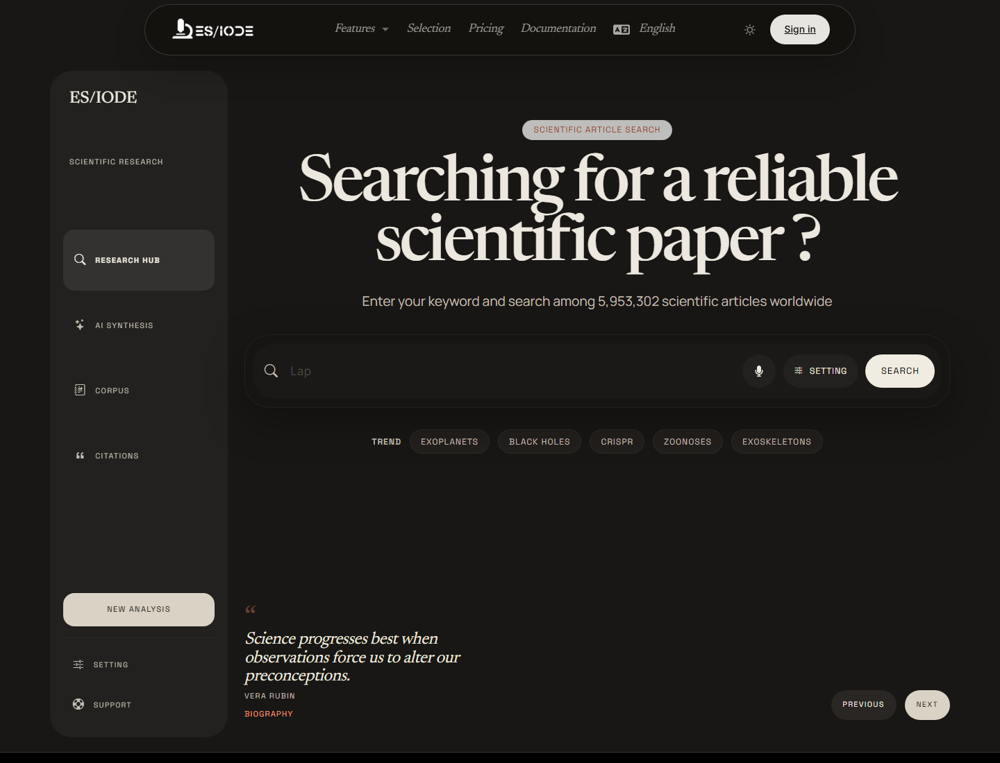

# Scientific **Articles Search**

ES/IODE scientific article search helps identify relevant publications from a question, topic, or set of keywords. It supports literature monitoring, bibliography preparation, exploration of emerging fields, and rapid verification of a scientific corpus.

```text
https://ethicseido.com/Iode/Search
```



## Prepare a useful query

A good query is precise without being too restrictive. Start with the central concepts, then add constraints such as population, mechanism, technique, organism, material, period, disease, or discipline.

Useful query patterns include:

- mechanism: `neuroinflammation Alzheimer biomarker`
- method: `CRISPR off-target detection`
- applied field: `machine learning protein folding review`
- clinical or biological question: `microbiome response immunotherapy melanoma`
- DOI identifier to retrieve a specific publication: `10.1186/s12883-021-02225-5`

When you have a DOI, use it as a direct query. This is the most precise way to check whether a specific publication is indexed and to avoid ambiguity from similar titles, acronyms, or author homonyms.

## Read the results

Results may include title, source, category, date, abstract or excerpt, and access to document detail when available. For scientific use, check:

- alignment between title, abstract, and your initial question;
- publication date, especially in fast-moving fields;
- study type: review, experimental study, observational study, preprint, or methodological article;
- source and available metadata;
- consistency of keywords with the field vocabulary.

## Settings and AI assistant

The settings button in the search area lets you enable the ES/IODE AI assistant when available. The assistant can help refine a query, suggest analytical angles, clarify concepts, or support interpretation of a result set.

Historically documented models are:

- **bright**: reliable and accessible assistance for scientific research.
- **genius**: more technical assistance for experienced researchers.

!!! warning "Critical reading"
    The AI assistant supports exploration. It does not replace reading the article, assessing methodology, or checking primary sources.

## Detail, translation, and traceability

Open a result to review metadata, abstract, and publication information. When translation is available, use it as a reading aid, but keep key scientific terms in their original language when terminological precision matters.

For reproducible work, record the search date, keywords, filters, and selected references. This makes it easier to update a literature review or compare with other databases.

## Limits and access

Public search is available from the site. Some advanced features, higher quotas, or account actions require sign-in or a paid offer. Results should be checked against original publications before scientific conclusions or professional decisions.
