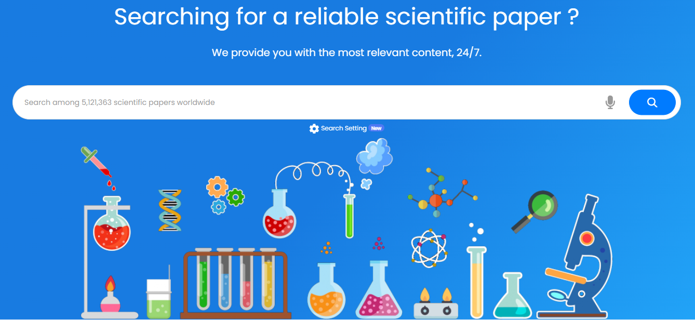

## **Empezando**

Para comenzar a utilizar la función de búsqueda de artículos científicos de __ES/IODE__, simplemente ingrese palabras clave relevantes en la barra de búsqueda en el centro de la página.

Regístrese para obtener una cuenta gratuita y disfrute de funciones avanzadas.

__ES/IODE__ está aquí para ayudarlo en su búsqueda de conocimiento científico.

No dude en contactarnos si tiene alguna pregunta o comentario.

¡Feliz búsqueda! :rocket:

## **Configuración de búsqueda**

Haga clic en el ícono :material-cog: debajo de la barra de búsqueda, luego puede activar el asistente de inteligencia artificial __ES/IODE__ y seleccionar el modelo.

- Modelo __bright__: Este modelo tiene como objetivo ayudar a los investigadores y proporcionar respuestas científicas confiables.
- Modelo __genius__: Este modelo tiene como objetivo ayudar a investigadores experimentados y proporcionar respuestas científicas muy técnicas y confiables.

El Asistente de IA de __ES/IODE__ es una inteligencia artificial generativa que hemos diseñado para ayudarlo a profundizar en sus temas de investigación científica mientras brinda asistencia en su progreso y comprensión.
