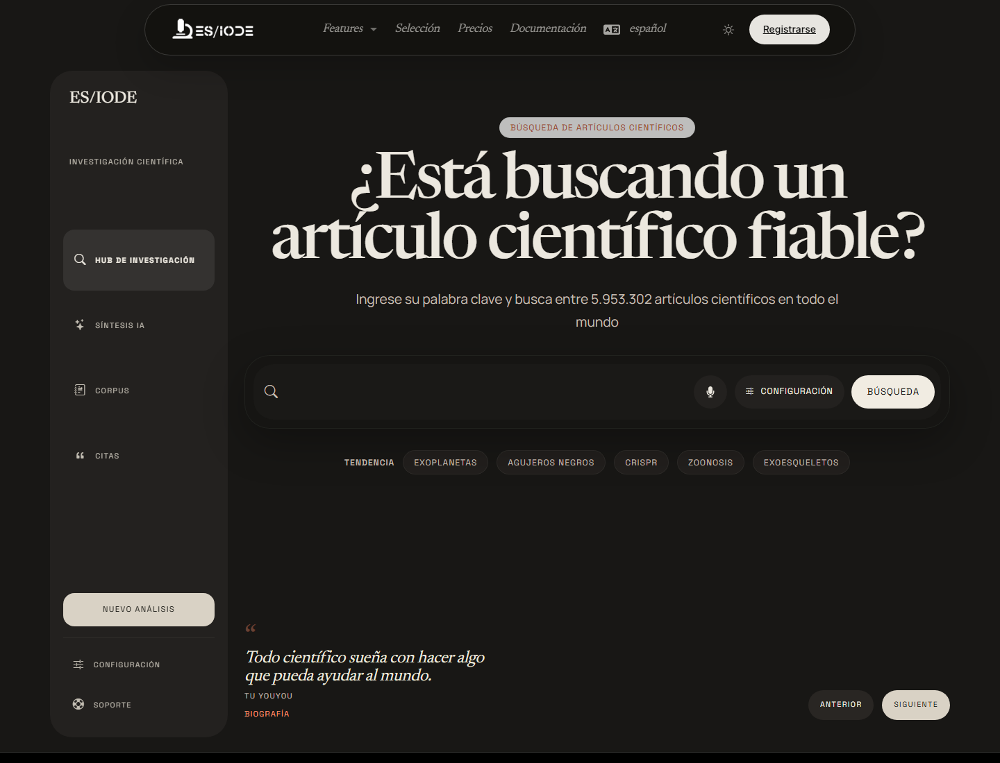

# Búsqueda de **artículos científicos**

La búsqueda de artículos científicos de ES/IODE ayuda a identificar publicaciones relevantes a partir de una pregunta, un tema o un conjunto de palabras clave. Está pensada para apoyar la vigilancia bibliográfica, la preparación de revisiones, la exploración de campos emergentes y la verificación rápida de un corpus científico.

```text
https://ethicseido.com/Iode/Search
```



## Preparar una consulta útil

Una buena consulta debe ser precisa sin ser demasiado cerrada. Empieza con los conceptos centrales y añade progresivamente restricciones como población, mecanismo, técnica, organismo, material, periodo, enfermedad o disciplina.

Patrones útiles:

- mecanismo: `neuroinflammation Alzheimer biomarker`
- método: `CRISPR off-target detection`
- campo aplicado: `machine learning protein folding review`
- pregunta clínica o biológica: `microbiome response immunotherapy melanoma`
- identificador DOI para recuperar una publicación concreta: `10.1186/s12883-021-02225-5`

Cuando dispongas de un DOI, úsalo como consulta directa. Es la forma más precisa de comprobar si una publicación específica está indexada y de evitar ambigüedades por títulos similares, acrónimos u homonimias de autores.

## Leer los resultados

Los resultados pueden mostrar título, fuente, categoría, fecha, resumen o extracto y acceso al detalle del documento cuando está disponible. Para un uso científico, comprueba:

- la coherencia entre título, resumen y pregunta inicial;
- la fecha de publicación, especialmente en áreas de rápida evolución;
- el tipo de estudio: revisión, estudio experimental, observacional, prepublicación o artículo metodológico;
- la fuente y los metadatos disponibles;
- la coherencia de las palabras clave con el vocabulario del área.

## Ajustes y asistente de IA

El botón de configuración del área de búsqueda permite activar el asistente de IA de ES/IODE cuando está disponible. El asistente puede ayudar a reformular una consulta, sugerir ángulos de análisis, aclarar conceptos o apoyar la interpretación de un conjunto de resultados.

Modelos documentados históricamente:

- **bright**: asistencia fiable y accesible para investigación científica.
- **genius**: asistencia más técnica para investigadores experimentados.

!!! warning "Lectura crítica"
    El asistente de IA ayuda a explorar. No sustituye la lectura del artículo, la evaluación metodológica ni la verificación de fuentes primarias.

## Detalle, traducción y trazabilidad

Abre un resultado para revisar metadatos, resumen e información de publicación. Cuando haya traducción, úsala como ayuda de lectura, pero conserva los términos científicos clave en su idioma original cuando la precisión terminológica sea importante.

Para un trabajo reproducible, registra la fecha de búsqueda, palabras clave, filtros y referencias seleccionadas. Esto facilita actualizar una revisión bibliográfica o comparar con otras bases.

## Límites y acceso

La búsqueda pública está disponible desde el sitio. Algunas funciones avanzadas, cuotas superiores o acciones de cuenta requieren iniciar sesión o una oferta de pago. Los resultados deben contrastarse con las publicaciones originales antes de formular conclusiones científicas o decisiones profesionales.
