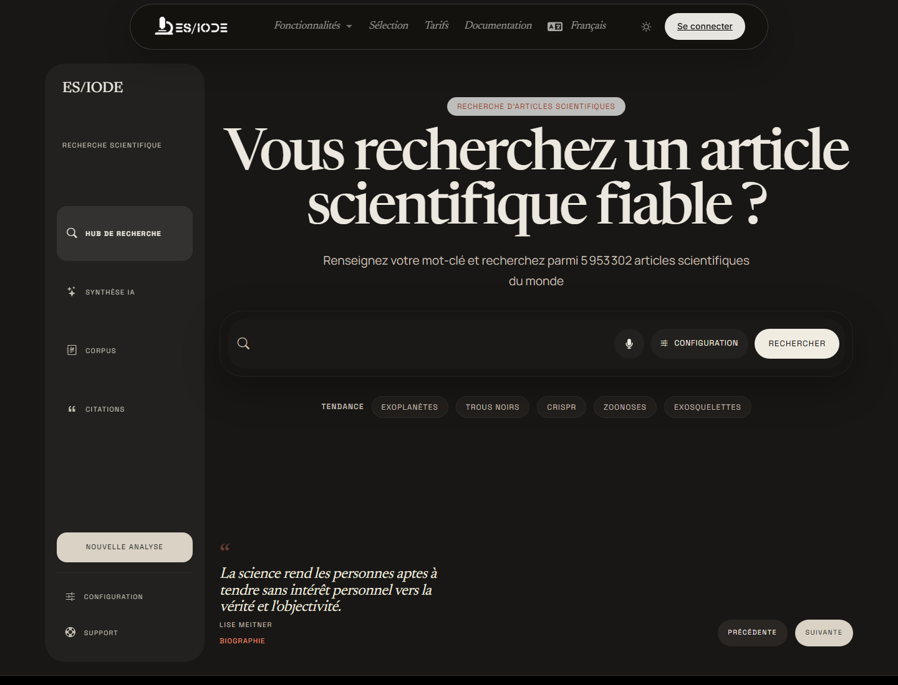

# Recherche d'**articles scientifiques**

La recherche d'articles scientifiques ES/IODE aide à identifier des publications pertinentes à partir d'une question, d'un sujet ou d'un ensemble de mots-clés. Elle est conçue pour soutenir la veille, la préparation bibliographique, l'exploration d'un domaine émergent et la vérification rapide d'un corpus scientifique.

```text
https://ethicseido.com/Iode/Search
```



## Préparer une requête exploitable

Une bonne requête doit être précise sans être trop fermée. Commencez avec les concepts centraux du sujet, puis ajoutez progressivement les contraintes: population, mécanisme, technique, organisme, matériau, période, pathologie ou domaine disciplinaire.

Exemples de formulation:

- un mécanisme: `neuroinflammation Alzheimer biomarker`
- une méthode: `CRISPR off-target detection`
- un domaine appliqué: `machine learning protein folding review`
- une question clinique ou biologique: `microbiome response immunotherapy melanoma`
- un identifiant DOI pour retrouver une publication précise: `10.1186/s12883-021-02225-5`

Lorsque vous disposez d'un DOI, utilisez-le comme requête directe. C'est la méthode la plus précise pour vérifier si une publication spécifique est indexée et pour éviter les ambiguïtés liées aux titres proches, acronymes ou homonymies d'auteurs.

## Lire les résultats

Les résultats peuvent inclure le titre, la source, la catégorie, la date, un résumé ou un extrait, ainsi qu'un accès au détail du document lorsque disponible. Pour une lecture scientifique, vérifiez systématiquement:

- la proximité entre le titre, le résumé et votre question initiale;
- la date de publication, surtout pour les domaines qui évoluent rapidement;
- le type d'étude: revue, étude expérimentale, étude observationnelle, prépublication ou article méthodologique;
- la source et les métadonnées disponibles;
- la cohérence des mots-clés avec le vocabulaire du domaine.

## Assistant IA et paramètres

Le bouton de configuration intégré à la zone de recherche permet d'activer l'assistant IA ES/IODE lorsque l'option est disponible. L'assistant peut aider à reformuler une requête, suggérer des angles d'analyse, clarifier des notions ou accompagner l'interprétation d'un ensemble de résultats.

Les modèles historiquement documentés sont:

- **bright**: assistance fiable et accessible pour la recherche scientifique.
- **genius**: assistance plus technique pour les chercheurs expérimentés.

!!! warning "Lecture critique"
    L'assistant IA sert d'aide à l'exploration. Il ne remplace pas la lecture de l'article, l'analyse méthodologique ni la vérification des sources primaires.

## Détail, traduction et traçabilité

Depuis un résultat, ouvrez le détail du document pour consulter les métadonnées, le résumé et les informations de publication disponibles. Lorsque la traduction est proposée, utilisez-la comme aide de lecture, mais conservez les termes scientifiques clés dans leur langue originale lorsque la précision terminologique est importante.

Pour un travail reproductible, notez la date de recherche, les mots-clés utilisés, les filtres éventuels et les références retenues. Cette traçabilité facilite la mise à jour d'une revue bibliographique ou la comparaison avec d'autres bases.

## Limites et accès

La recherche publique est accessible depuis le site. Certaines fonctions avancées, quotas augmentés ou actions liées au compte nécessitent une connexion ou une offre payante. Les résultats doivent être croisés avec les publications originales avant toute conclusion scientifique ou décision professionnelle.
