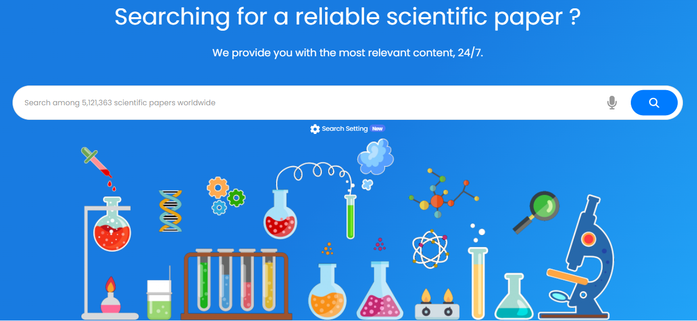

## **Premiers pas**

Pour commencer à utiliser la fonction de recherche d'articles scientifiques d'__ES/IODE__, il vous suffit d'entrer des mots-clés pertinents dans la barre de recherche au centre de la page.

Inscrivez-vous pour un compte gratuit afin de profiter de fonctionnalités avancées.

__ES/IODE__ est là pour vous aider dans votre quête de connaissances scientifiques.

N'hésitez pas à nous contacter si vous avez des questions ou des commentaires.

Bonne recherche ! :rocket:

## **Paramètres de recherche**

Cliquez sur l'icône :material-cog: sous la barre de recherche, puis vous pouvez activer l'assistant intelligent __ES/IODE__ et sélectionner le modèle.

- Modèle __bright__ : Ce modèle vise à aider les chercheurs et à fournir des réponses scientifiques fiables.
- Modèle __genius__ : Ce modèle vise à aider les chercheurs expérimentés et à fournir des réponses scientifiques très techniques et fiables.

L'Assistant intelligent __ES/IODE__ est une intelligence artificielle générative que nous avons conçue pour vous aider à approfondir vos sujets de recherche scientifique tout en fournissant une assistance dans leur progression et compréhension.
