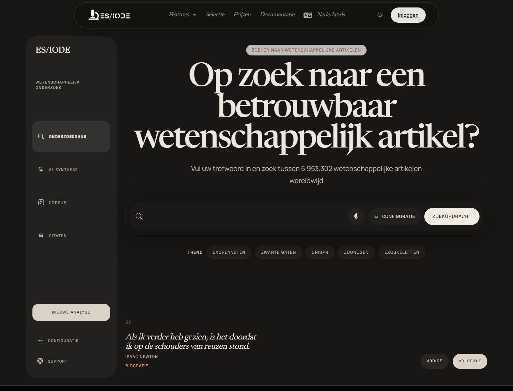

# Zoeken naar **wetenschappelijke artikelen**

De ES/IODE-zoekfunctie voor wetenschappelijke artikelen helpt relevante publicaties te vinden vanuit een vraag, onderwerp of reeks trefwoorden. Ze ondersteunt literatuurmonitoring, bibliografievoorbereiding, exploratie van opkomende domeinen en snelle controle van een wetenschappelijk corpus.

```text
https://ethicseido.com/Iode/Search
```



## Een bruikbare zoekvraag voorbereiden

Een goede zoekvraag is precies zonder te smal te zijn. Begin met de centrale concepten en voeg daarna beperkingen toe zoals populatie, mechanisme, techniek, organisme, materiaal, periode, aandoening of discipline.

Voorbeelden:

- mechanisme: `neuroinflammation Alzheimer biomarker`
- methode: `CRISPR off-target detection`
- toegepast domein: `machine learning protein folding review`
- klinische of biologische vraag: `microbiome response immunotherapy melanoma`
- DOI-identificatie om een specifieke publicatie terug te vinden: `10.1186/s12883-021-02225-5`

Wanneer je een DOI hebt, gebruik die dan als directe zoekopdracht. Dit is de meest precieze manier om te controleren of een specifieke publicatie is geïndexeerd en om ambiguïteit door vergelijkbare titels, acroniemen of gelijknamige auteurs te vermijden.

## Resultaten lezen

Resultaten kunnen titel, bron, categorie, datum, samenvatting of fragment en toegang tot details bevatten. Controleer bij wetenschappelijk gebruik:

- aansluiting tussen titel, samenvatting en oorspronkelijke vraag;
- publicatiedatum, vooral in snel veranderende domeinen;
- studietype: review, experimentele studie, observationele studie, preprint of methodologisch artikel;
- bron en beschikbare metadata;
- consistentie van trefwoorden met het vakvocabulaire.

## Instellingen en AI-assistent

Via de instellingen kan de ES/IODE AI-assistent worden geactiveerd wanneer beschikbaar. De assistent kan helpen een zoekvraag te verfijnen, analysehoeken voor te stellen, concepten te verduidelijken of een resultatenset te interpreteren.

- **bright**: betrouwbare en toegankelijke ondersteuning voor wetenschappelijk onderzoek.
- **genius**: meer technische ondersteuning voor ervaren onderzoekers.

!!! warning "Kritisch lezen"
    De AI-assistent ondersteunt verkenning. Hij vervangt niet het lezen van artikelen, methodologische beoordeling of controle van primaire bronnen.

## Detail, vertaling en traceerbaarheid

Open een resultaat om metadata, samenvatting en publicatie-informatie te bekijken. Gebruik vertaling als leeshulp, maar behoud belangrijke wetenschappelijke termen in de oorspronkelijke taal wanneer terminologische precisie nodig is.

Noteer voor reproduceerbaar werk zoekdatum, trefwoorden, filters en geselecteerde referenties. Zo kun je een literatuurreview later actualiseren of vergelijken met andere databanken.

## Grenzen en toegang

Sommige geavanceerde functies, hogere quota of accountacties vereisen aanmelden of een betaald aanbod. Resultaten moeten met originele publicaties worden vergeleken voordat wetenschappelijke conclusies of professionele beslissingen worden genomen.
