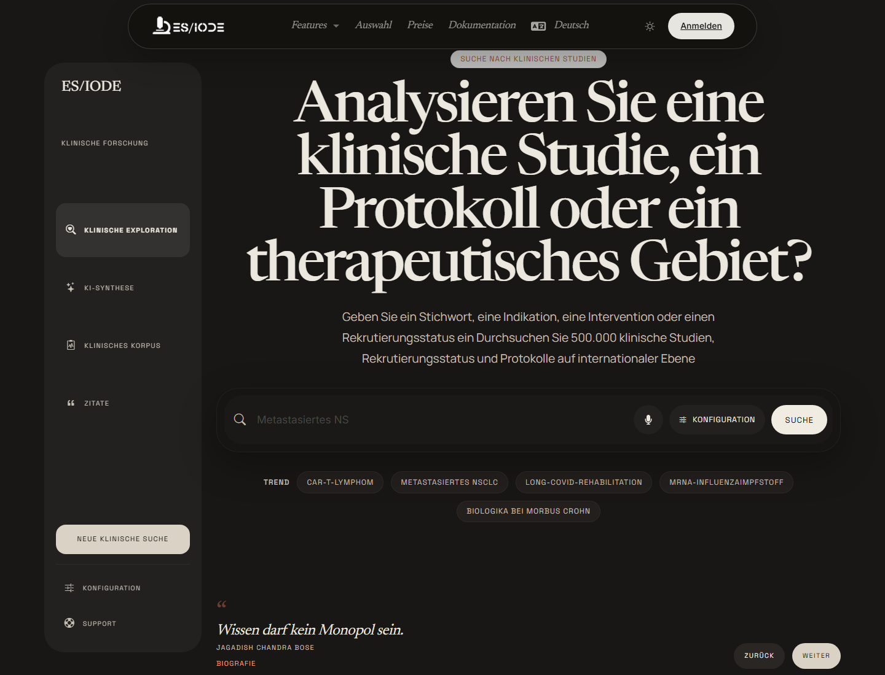

# Suche nach **klinischen Studien**

Die Suche nach klinischen Studien hilft, Protokolle, Rekrutierungsstatus, Interventionen, Erkrankungen und therapeutische Bereiche zu untersuchen. Sie eignet sich zur Beobachtung translationaler Aktivität, Identifikation laufender Studien und Ergänzung der Literaturrecherche um eine klinische Perspektive.

```text
https://ethicseido.com/Iode/SearchClinicalTrial
```



## Suche aufbauen

Kombinieren Sie Begriffe zu Erkrankung, Intervention, Population, Biomarker oder Mechanismus:

- Erkrankung oder klinischer Subtyp;
- therapeutische Klasse, Molekül, Gerät oder Intervention;
- Rekrutierungsstatus oder Phase, wenn verfügbar;
- Zielpopulation, Alter, Geschlecht oder klinischer Kontext;
- biologisches Kriterium oder relevanter Endpunkt.

## Ergebnisse interpretieren

Eine klinische Studie muss über ihr Protokoll gelesen werden. Prüfen Sie Status, Phase, Ein- und Ausschlusskriterien, Intervention, Vergleichsarm, Endpunkte und Standort. Eine aktive Studie bedeutet nicht, dass eine Behandlung validiert ist; sie zeigt, dass eine klinische Hypothese geprüft wird.

Vergleichen Sie Studien mit verfügbaren Publikationen, um präklinische Hypothesen, laufende Protokolle, Zwischenergebnisse, begutachtete Publikationen und klinische Empfehlungen zu unterscheiden.

## KI-Assistent und Kontext

Wenn verfügbar, kann der KI-Assistent Suchanfragen reformulieren, Protokollbegriffe erklären, Therapieansätze vergleichen oder Fragen identifizieren, die in Registern und Primärpublikationen zu prüfen sind.

!!! warning "Medizinische Information"
    ES/IODE unterstützt die Suche nach wissenschaftlichen und klinischen Informationen. Ergebnisse ersetzen keine professionelle medizinische Beratung, kein offizielles Protokoll und keine regulatorische Empfehlung.

## Gute Praxis

Notieren Sie Konsultationsdatum, Schlüsselwörter, Register oder Quellen und Studienkennungen. Für wissenschaftliche Synthesen sollten Studien immer mit Publikationen, methodischen Kriterien und regulatorischem Kontext verbunden werden.
