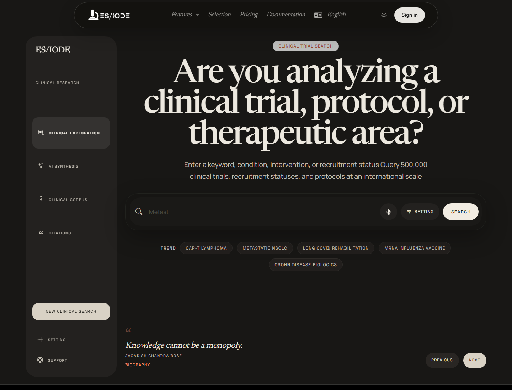

# Clinical **Trials Search**

ES/IODE clinical trials search helps explore protocols, recruitment status, interventions, diseases, and therapeutic areas. It is useful for tracking translational activity, identifying ongoing trials, and complementing literature search with a clinical view.

```text
https://ethicseido.com/Iode/SearchClinicalTrial
```



## Build the search

Use terms related to the condition, intervention, population, biomarker, or mechanism. To broaden or narrow exploration, combine:

- disease name or clinical subtype;
- therapeutic class, molecule, device, or intervention;
- recruitment status or phase when available;
- target population, age, sex, or clinical context;
- biological criterion or endpoint of interest.

## Interpret results

A clinical trial should be read through its protocol. Review status, phase, inclusion and exclusion criteria, intervention, comparator, endpoints, and location. An active trial does not mean that a treatment is validated; it means a clinical hypothesis is being evaluated.

Compare trials with available scientific publications to distinguish:

- preclinical hypothesis;
- ongoing protocol;
- interim results;
- peer-reviewed publication;
- clinical recommendation or authorized use.

## AI assistant and context

When available, the AI assistant can help reformulate a search, explain protocol vocabulary, compare therapeutic approaches, or identify questions to verify in registries and primary publications.

!!! warning "Medical information"
    ES/IODE helps search scientific and clinical information. Results do not replace professional medical advice, an official protocol, or a regulatory recommendation.

## Good practices

Record the consultation date, keywords, consulted registries or sources, and trial identifiers when available. For scientific synthesis, always connect trials with published articles, methodological criteria, and regulatory context.

## Account and limits

Some options may be limited by the active offer, account sign-in, or public service quotas.
