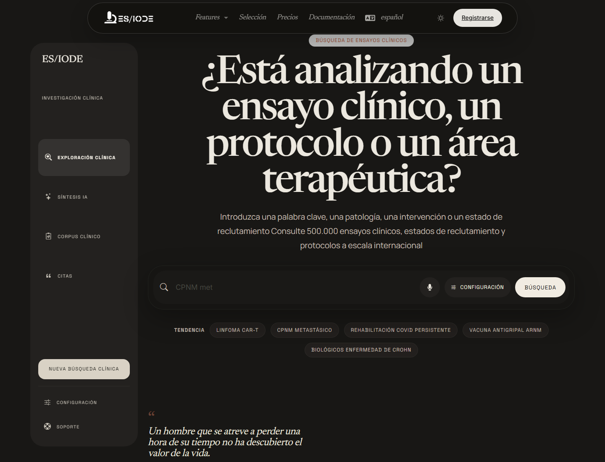

# Búsqueda de **ensayos clínicos**

La búsqueda de ensayos clínicos de ES/IODE permite explorar protocolos, estados de reclutamiento, intervenciones, enfermedades y áreas terapéuticas. Es útil para seguir la actividad traslacional de un campo, identificar ensayos en curso y complementar una búsqueda bibliográfica con una visión clínica.

```text
https://ethicseido.com/Iode/SearchClinicalTrial
```



## Construir la búsqueda

Usa términos relacionados con la enfermedad, intervención, población, biomarcador o mecanismo. Para ampliar o acotar la exploración, combina:

- nombre de enfermedad o subtipo clínico;
- clase terapéutica, molécula, dispositivo o intervención;
- estado de reclutamiento o fase cuando esté disponible;
- población objetivo, edad, sexo o contexto clínico;
- criterio biológico o endpoint de interés.

## Interpretar resultados

Un ensayo clínico debe leerse a través de su protocolo. Examina estado, fase, criterios de inclusión y exclusión, intervención, comparador, criterios de valoración y localización. Un ensayo activo no significa que un tratamiento esté validado; indica que una hipótesis clínica está siendo evaluada.

Compara los ensayos con publicaciones científicas disponibles para distinguir:

- hipótesis preclínica;
- protocolo en curso;
- resultados intermedios;
- publicación revisada por pares;
- recomendación clínica o uso autorizado.

## Asistente de IA y contexto

Cuando está disponible, el asistente de IA puede ayudar a reformular una búsqueda, explicar vocabulario de protocolo, comparar enfoques terapéuticos o identificar preguntas que conviene verificar en registros y publicaciones primarias.

!!! warning "Información médica"
    ES/IODE ayuda a buscar información científica y clínica. Los resultados no sustituyen el consejo médico profesional, un protocolo oficial ni una recomendación regulatoria.

## Buenas prácticas

Registra la fecha de consulta, palabras clave, registros o fuentes consultadas e identificadores de ensayo cuando estén disponibles. Para una síntesis científica, relaciona siempre los ensayos con artículos publicados, criterios metodológicos y contexto regulatorio.

## Cuenta y límites

Algunas opciones pueden estar limitadas por la oferta activa, el inicio de sesión o las cuotas públicas del servicio.
