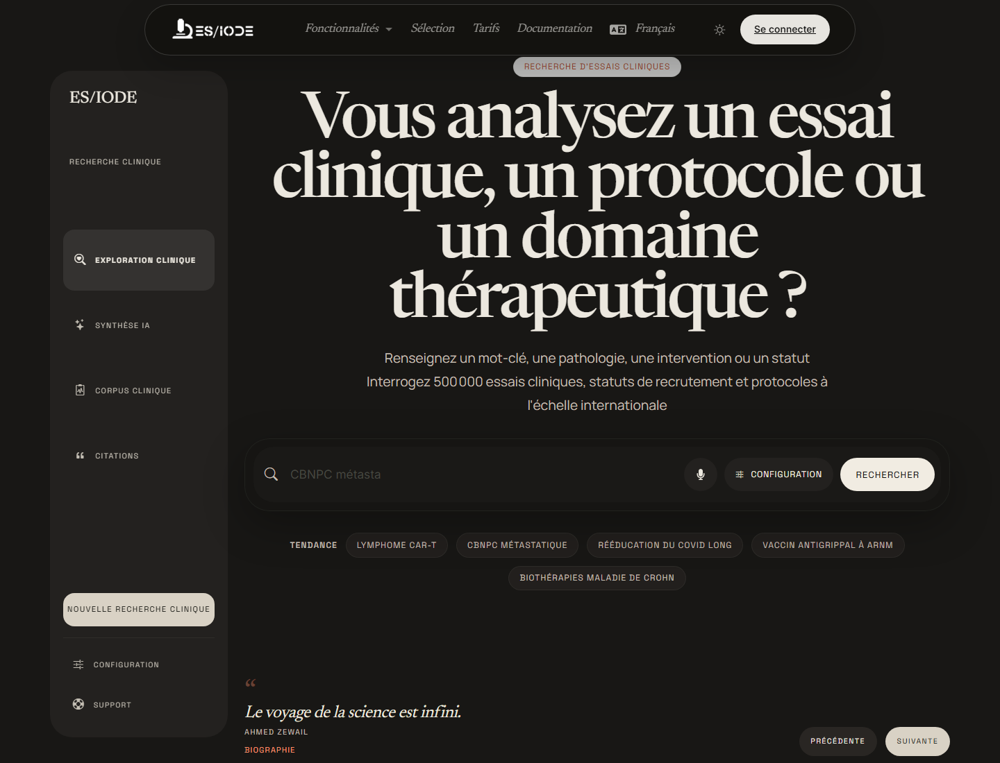

# Recherche d'**essais cliniques**

La recherche d'essais cliniques ES/IODE permet d'explorer des protocoles, statuts de recrutement, interventions, pathologies et domaines thérapeutiques. Elle est utile pour suivre l'activité translationnelle d'un domaine, identifier des essais en cours et compléter une recherche bibliographique par une vision clinique.

```text
https://ethicseido.com/Iode/SearchClinicalTrial
```



## Construire la recherche

Utilisez des termes liés à la pathologie, à l'intervention, à la population, au biomarqueur ou au mécanisme étudié. Pour élargir ou resserrer l'exploration, combinez:

- nom de maladie ou sous-type clinique;
- classe thérapeutique, molécule, dispositif ou intervention;
- statut de recrutement ou phase, si disponible;
- population ciblée, âge, sexe ou contexte clinique;
- critère biologique ou endpoint d'intérêt.

## Interpréter les résultats

Un essai clinique doit être lu à travers son protocole. Examinez le statut, la phase, les critères d'inclusion et d'exclusion, l'intervention, le comparateur, les critères de jugement et la localisation. Un essai actif ne signifie pas qu'un traitement est validé; il indique qu'une hypothèse clinique est en cours d'évaluation.

Comparez les essais avec les publications scientifiques disponibles pour distinguer:

- hypothèse préclinique;
- protocole en cours;
- résultats intermédiaires;
- publication évaluée par les pairs;
- recommandation clinique ou usage autorisé.

## Assistant IA et contexte

Lorsque l'assistant IA est disponible, il peut aider à reformuler une recherche, expliquer un vocabulaire de protocole, comparer des approches thérapeutiques ou identifier des questions à vérifier dans les registres et publications primaires.

!!! warning "Information médicale"
    ES/IODE aide à rechercher des informations scientifiques et cliniques. Les résultats ne remplacent pas l'avis d'un professionnel de santé, un protocole officiel ou une recommandation réglementaire.

## Bonnes pratiques

Notez la date de consultation, les mots-clés, les registres ou sources consultés et les identifiants d'essais lorsque disponibles. Pour une synthèse scientifique, reliez toujours les essais aux articles publiés, aux critères méthodologiques et au contexte réglementaire.

## Compte et limites

Certaines options peuvent être limitées par l'offre active, la connexion au compte ou les quotas publics du service.
