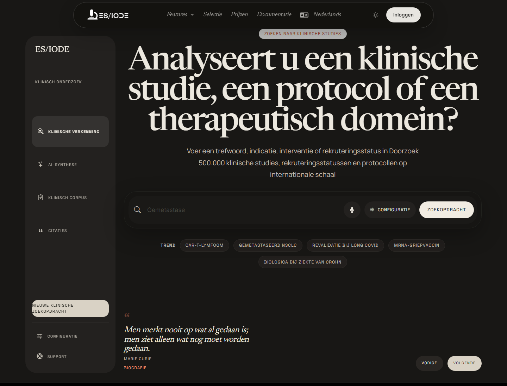

# Zoeken naar **klinische onderzoeken**

De zoekfunctie voor klinische onderzoeken helpt protocollen, rekruteringsstatus, interventies, aandoeningen en therapeutische domeinen te verkennen. Ze is nuttig om translationele activiteit te volgen, lopende onderzoeken te vinden en literatuuronderzoek aan te vullen met een klinisch perspectief.

```text
https://ethicseido.com/Iode/SearchClinicalTrial
```



## De zoekopdracht opbouwen

Gebruik termen rond aandoening, interventie, populatie, biomarker of mechanisme. Combineer:

- ziekte of klinisch subtype;
- therapeutische klasse, molecule, apparaat of interventie;
- rekruteringsstatus of fase wanneer beschikbaar;
- doelpopulatie, leeftijd, geslacht of klinische context;
- biologisch criterium of relevante endpoint.

## Resultaten interpreteren

Een klinisch onderzoek moet via het protocol worden gelezen. Bekijk status, fase, inclusie- en exclusiecriteria, interventie, comparator, endpoints en locatie. Een actief onderzoek betekent niet dat een behandeling gevalideerd is; het betekent dat een klinische hypothese wordt geëvalueerd.

Vergelijk onderzoeken met beschikbare publicaties om preklinische hypothesen, lopende protocollen, tussentijdse resultaten, peer-reviewed publicaties en klinische aanbevelingen te onderscheiden.

## AI-assistent en context

Wanneer beschikbaar kan de AI-assistent helpen zoekvragen te herformuleren, protocoltermen uit te leggen, therapeutische benaderingen te vergelijken of vragen te identificeren die in registers en primaire publicaties moeten worden gecontroleerd.

!!! warning "Medische informatie"
    ES/IODE helpt bij het zoeken naar wetenschappelijke en klinische informatie. Resultaten vervangen geen professioneel medisch advies, officieel protocol of regelgevende aanbeveling.

## Goede praktijken

Noteer consultatiedatum, trefwoorden, geraadpleegde registers of bronnen en trial-identificaties. Verbind klinische onderzoeken voor wetenschappelijke synthese altijd met gepubliceerde artikelen, methodologische criteria en regelgevende context.
