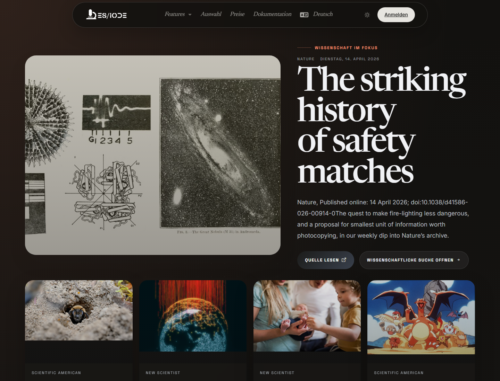

# **Wissenschaftliche Nachrichten**

ES/IODE-Wissenschaftsnachrichten helfen, aktuelle Signale aus externen Quellen zu verfolgen: Forschungsankündigungen, wichtige Publikationen, institutionelle Ergebnisse, Pressemitteilungen oder aufkommende Themen. Sie ergänzen die Artikelsuche durch einen schnellen Überblick über Entwicklungen.

```text
https://ethicseido.com/Iode/ScienceNews
```



## Nachrichten wissenschaftlich lesen

Eine Karte kann Quelle, Datum, Titel und Auszug anzeigen. Für wissenschaftliche Nutzung ist wichtig, Nachrichten von publizierter Evidenz zu unterscheiden. Eine Nachricht kann auf ein relevantes Ergebnis hinweisen, muss aber mit Originalartikel, Bericht, Datensatz oder institutioneller Mitteilung verbunden werden.

## Nutzung für Monitoring

Verwenden Sie Nachrichten, um neue Themen zu erkennen, sehr aktuelle Ergebnisse zu finden, Institutionen oder Zeitschriften zu verfolgen, Schlüsselbegriffe für die Artikelsuche zu gewinnen und thematische Beobachtung vorzubereiten.

## Nach der Lektüre vertiefen

Suchen Sie zentrale Fachbegriffe anschließend in ES/IODE. Prüfen Sie, ob ein begutachteter Artikel, Preprint, Protokoll, Studienregister oder institutioneller Datensatz existiert.

!!! note
    Inhalte bleiben bei ihren jeweiligen Quellen veröffentlicht. ES/IODE unterstützt Entdeckung; wissenschaftliche Validierung erfordert Primärquellen.
