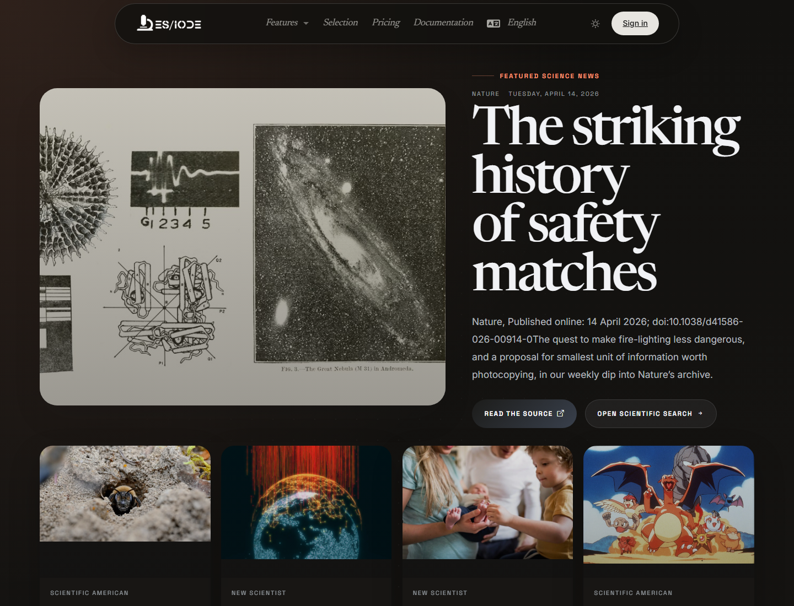

# Scientific **News**

ES/IODE scientific news helps monitor recent signals from external sources: research announcements, major publications, institutional results, press releases, or emerging topics. It complements article search by offering a quick view of scientific developments.

```text
https://ethicseido.com/Iode/ScienceNews
```



## Read scientific news

Each card may show source, date, title, and excerpt. For scientific audiences, it is important to distinguish news from published evidence. A news item may signal an important result, but it should be connected to the original article, report, dataset, or institutional release.

## Monitoring use

Use scientific news to:

- detect emerging topics;
- identify very recent publications or results;
- follow institutions, journals, or agencies;
- extract keywords for article search;
- prepare thematic monitoring.

## Deepen after reading

After opening a news item, search core scientific terms in ES/IODE. Check whether a peer-reviewed article, preprint, protocol, trial registry, or institutional dataset is associated with it.

!!! note
    Content remains published by its respective sources. ES/IODE supports discovery, but scientific validation relies on reviewing primary sources.
