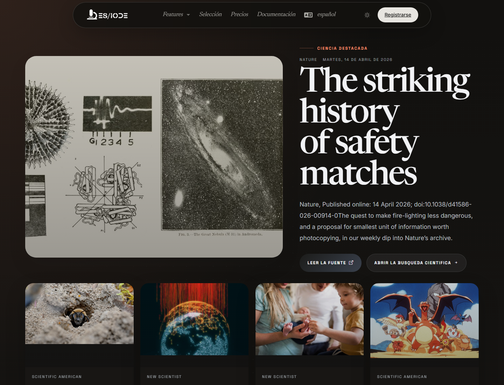

# Noticias **científicas**

Las noticias científicas de ES/IODE sirven para seguir señales recientes de fuentes externas: anuncios de investigación, publicaciones relevantes, resultados institucionales, comunicados o temas emergentes. Complementan la búsqueda de artículos ofreciendo una visión rápida de la actualidad científica.

```text
https://ethicseido.com/Iode/ScienceNews
```



## Leer una noticia científica

Cada tarjeta puede indicar fuente, fecha, título y extracto. Para una audiencia científica, es importante distinguir una noticia de una evidencia publicada. Una noticia puede señalar un resultado importante, pero debe conectarse con el artículo, informe, conjunto de datos o comunicado original.

## Uso para vigilancia

Usa las noticias para:

- detectar temas emergentes;
- identificar publicaciones o resultados muy recientes;
- seguir instituciones, revistas o agencias;
- extraer palabras clave para la búsqueda de artículos;
- preparar una vigilancia temática.

## Profundizar después de leer

Después de abrir una noticia, busca los términos científicos centrales en ES/IODE. Comprueba si existe un artículo revisado por pares, una prepublicación, un protocolo, un registro de ensayo o un conjunto de datos institucional asociado.

!!! note
    Los contenidos siguen publicados por sus fuentes respectivas. ES/IODE facilita el descubrimiento, pero la validación científica depende de revisar fuentes primarias.
