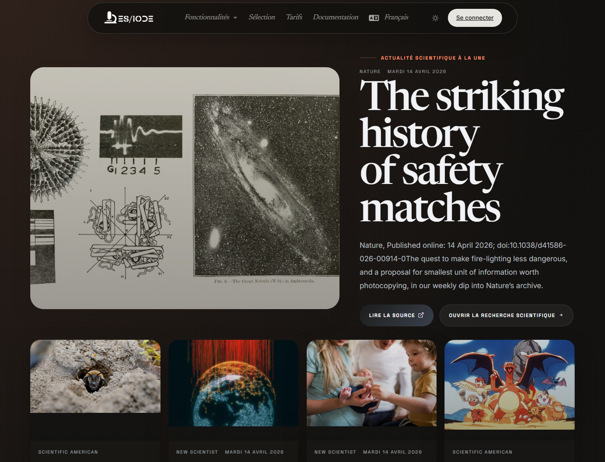

# Actualités **scientifiques**

Les actualités scientifiques ES/IODE servent à suivre les signaux récents issus de sources externes: annonces de recherche, publications majeures, résultats institutionnels, communiqués ou sujets émergents. Cette page complète la recherche d'articles en donnant une vue rapide de l'actualité scientifique.

```text
https://ethicseido.com/Iode/ScienceNews
```



## Lire une actualité scientifique

Chaque carte peut indiquer la source, la date, le titre et un extrait. Pour une audience scientifique, il est important de distinguer une actualité d'une preuve publiée. Une actualité peut signaler un résultat important, mais elle doit être reliée à l'article, au rapport, au jeu de données ou au communiqué original.

## Utilisation pour la veille

Utilisez les actualités pour:

- repérer des sujets émergents;
- détecter des publications ou résultats très récents;
- suivre l'activité d'institutions, revues ou agences;
- identifier des mots-clés à transférer dans la recherche d'articles;
- préparer une veille thématique.

## Approfondir après lecture

Après avoir ouvert une actualité, recherchez les termes scientifiques centraux dans ES/IODE. Vérifiez s'il existe un article évalué par les pairs, une prépublication, un protocole, un registre d'essai ou une donnée institutionnelle associée.

!!! note
    Les contenus restent publiés par leurs sources respectives. ES/IODE facilite la découverte, mais la validation scientifique repose sur l'examen des sources primaires.
