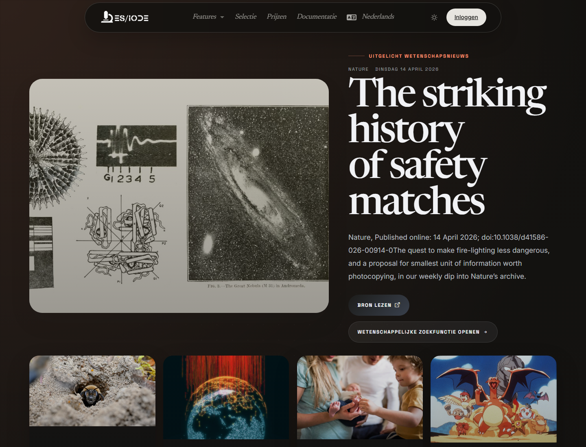

# **Wetenschappelijk nieuws**

ES/IODE-wetenschapsnieuws helpt recente signalen uit externe bronnen te volgen: onderzoeksberichten, belangrijke publicaties, institutionele resultaten, persberichten of opkomende onderwerpen. Het vult artikelzoekopdrachten aan met een snelle blik op wetenschappelijke ontwikkelingen.

```text
https://ethicseido.com/Iode/ScienceNews
```



## Wetenschapsnieuws lezen

Een kaart kan bron, datum, titel en fragment tonen. Voor wetenschappelijk gebruik is het belangrijk nieuws te onderscheiden van gepubliceerde evidentie. Een nieuwsitem kan een relevant resultaat signaleren, maar moet worden verbonden met het oorspronkelijke artikel, rapport, dataset of institutioneel bericht.

## Gebruik voor monitoring

Gebruik nieuws om opkomende thema's te herkennen, zeer recente resultaten te vinden, instellingen of tijdschriften te volgen, trefwoorden voor artikelzoekopdrachten te verzamelen en thematische monitoring voor te bereiden.

## Verdiepen na lezing

Zoek centrale wetenschappelijke termen daarna in ES/IODE. Controleer of er een peer-reviewed artikel, preprint, protocol, trialregister of institutionele dataset bestaat.

!!! note
    Inhoud blijft gepubliceerd door de respectieve bronnen. ES/IODE ondersteunt ontdekking; wetenschappelijke validatie vereist primaire bronnen.
