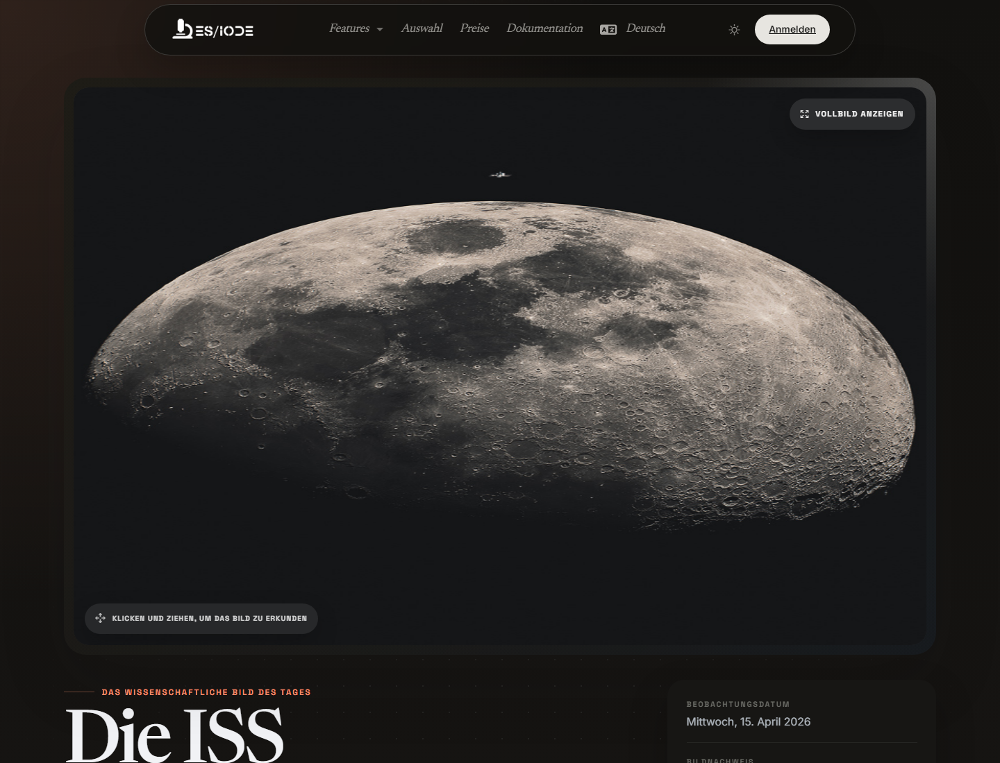

# **Wissenschaftliches Bild**

**Science picture** stellt ein wissenschaftliches Bild mit redaktionellem Kontext vor: astronomische Aufnahme, experimentelle Fotografie, technische Beobachtung, institutionelles Archivmaterial oder Illustration aus einer öffentlichen wissenschaftlichen Quelle. Der Nutzen ist nicht nur visuell: Die Seite hilft, eine Beobachtung mit ihrem wissenschaftlichen Kontext, ihrer Quelle und möglichen Recherchepfaden zu verbinden.

```text
https://ethicseido.com/Iode/ScienceImage
```



## Was die Seite bietet

- Ein wissenschaftliches Bild des Tages in einem immersiven Lesebereich.
- Einen redaktionellen Titel und, wenn verfügbar, ein Beobachtungs- oder Veröffentlichungsdatum.
- Bildnachweis und je nach Quelle Zugriff auf das Originalmedium oder eine zugehörige wissenschaftliche Ressource.
- Einen Übergang zur ES/IODE-Artikelsuche, um Phänomen, Objekt oder Fachgebiet weiter zu untersuchen.

## Vorgehensweise

Betrachten Sie das Bild zunächst ohne voreilige Interpretation: Struktur, Maßstab, Kontrast, Orientierung, sichtbare Beschriftungen, Instrumente oder Marker. Prüfen Sie danach Titel, Datum und Bildnachweis, um Quellentyp und Entstehungskontext einzuordnen.

Für eine wissenschaftliche Nutzung formulieren Sie eine oder zwei überprüfbare Fragen:

- Welches Phänomen wird dargestellt?
- Welche Beobachtungsmethode oder welches Instrument hat das Bild erzeugt?
- Handelt es sich um eine Rohbeobachtung, Rekonstruktion, Komposition oder Visualisierung?
- Welche aktuellen Publikationen ordnen diese Beobachtung in den Stand der Forschung ein?

## Recherche in ES/IODE vertiefen

Nutzen Sie zentrale Begriffe aus dem Bild in der Artikelsuche: Missionsname, Himmelsobjekt, Erkrankung, Bildgebungstechnik, Material, Organismus, Instrument oder Quellinstitution. Bei lebenswissenschaftlichen oder medizinischen Themen prüfen Sie zusätzlich, ob klinische Studien oder Beobachtungsstudien verfügbar sind.

## Hinweise zur Interpretation

Ein wissenschaftliches Bild kann eindrucksvoll sein, ohne allein als Beleg zu genügen. Prüfen Sie immer Quelle, Erhebungsprotokoll, Verarbeitungsschritte, Datum und fachlichen Kontext. Wenn das Bild aus einer Agentur oder einem öffentlichen Archiv stammt, konsultieren Sie das Originalmedium vor einer wissenschaftlichen Verwendung.

!!! info
    Diese Dokumentation beschreibt den öffentlich sichtbaren Ablauf. Konto- oder angebotsgeschützte Bildschirme werden ohne Testzugang nicht detailliert.
