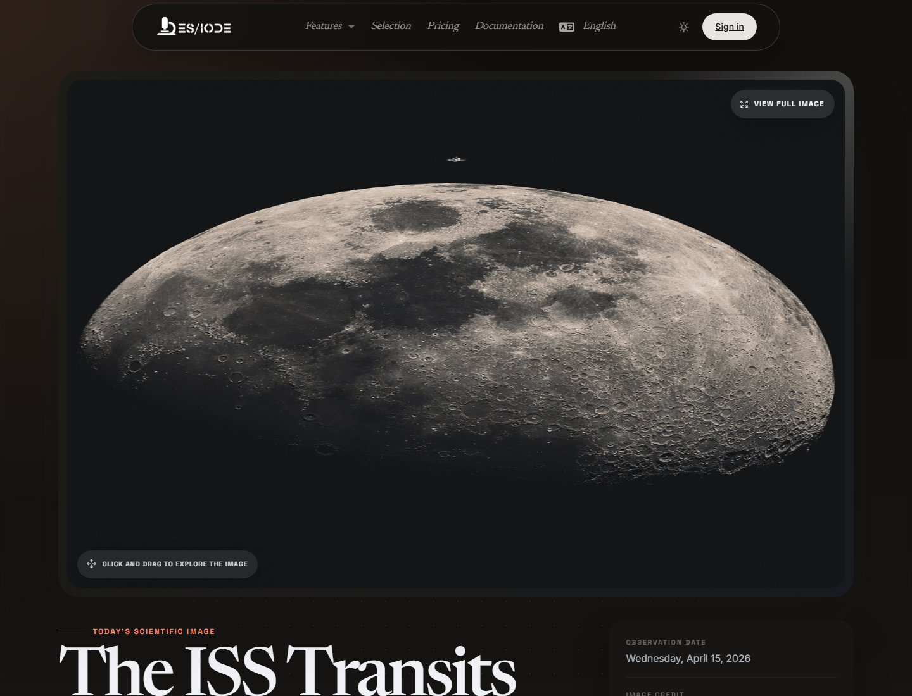

# Science **Picture**

**Science picture** highlights an editorialized scientific visual: astronomical image, experimental photograph, technical observation, institutional archive, or illustration from a public scientific source. The purpose is not only visual appeal: the page helps connect an observation to its scientific context, source, and related research paths.

```text
https://ethicseido.com/Iode/ScienceImage
```



## What the page provides

- A scientific image of the day in an immersive reading area.
- An editorial title and an observation or publication date when available.
- Image credit and, depending on the source, access to the original media or related scientific resource.
- A path back to ES/IODE scientific search to investigate the phenomenon, object, or field represented.

## How to use it

Start by observing the image before interpreting it: structure, scale, contrast, orientation, visible labels, instruments, or markers. Then review the title, date, and credit to identify the source type and production context.

For scientific use, formulate one or two verifiable questions:

- What phenomenon is represented?
- Which observation method or instrument produced the image?
- Is the image a raw observation, reconstruction, composite, or visualization?
- Which recent publications place this observation in the current state of the field?

## Deepen the research in ES/IODE

Use key terms from the image in scientific article search: mission name, celestial object, disease, imaging technique, material, organism, instrument, or source institution. If the topic relates to life sciences or health, also check whether clinical trials or observational studies are available.

## Interpretation cautions

A scientific image can be striking without being standalone evidence. Always check the source, acquisition protocol, processing steps, date, and disciplinary context. When the image comes from an agency or public archive, consult the original media before using it in scientific communication.

!!! info
    This documentation describes the visible public flow. Account- or offer-protected screens are not detailed without test access.
