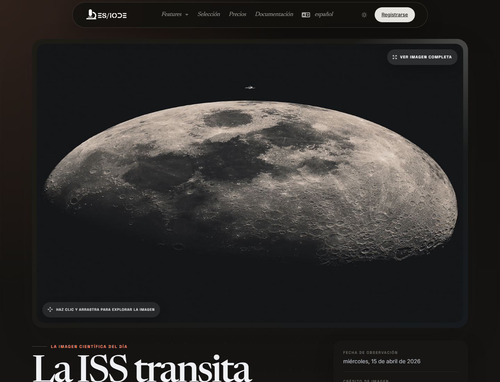

# Imagen **científica**

**Science picture** destaca un visual científico con contexto editorial: imagen astronómica, fotografía experimental, observación técnica, archivo institucional o ilustración procedente de una fuente científica pública. Su objetivo no es solo visual: la página ayuda a conectar una observación con su contexto científico, su fuente y posibles rutas de investigación.

```text
https://ethicseido.com/Iode/ScienceImage
```



## Qué aporta la página

- Una imagen científica del día en un espacio de lectura inmersivo.
- Un título editorial y una fecha de observación o publicación cuando están disponibles.
- Crédito de la imagen y, según la fuente, acceso al medio original o a un recurso científico relacionado.
- Un enlace de continuidad hacia la búsqueda científica de ES/IODE para investigar el fenómeno, objeto o campo representado.

## Método de uso

Empieza observando la imagen antes de interpretarla: estructura, escala, contraste, orientación, etiquetas visibles, instrumentos o marcadores. Después revisa el título, la fecha y el crédito para identificar el tipo de fuente y el contexto de producción.

Para un uso científico, formula una o dos preguntas verificables:

- ¿Qué fenómeno está representado?
- ¿Qué método de observación o instrumento produjo la imagen?
- ¿La imagen es una observación bruta, una reconstrucción, una composición o una visualización?
- ¿Qué publicaciones recientes sitúan esta observación en el estado actual del campo?

## Profundizar en ES/IODE

Usa términos clave de la imagen en la búsqueda de artículos científicos: nombre de misión, objeto celeste, enfermedad, técnica de imagen, material, organismo, instrumento o institución fuente. Si el tema pertenece a ciencias de la vida o salud, comprueba también si existen ensayos clínicos o estudios observacionales.

## Precauciones de interpretación

Una imagen científica puede ser impactante sin constituir por sí sola una prueba. Comprueba siempre la fuente, el protocolo de adquisición, los tratamientos aplicados, la fecha y el contexto disciplinar. Cuando la imagen proceda de una agencia o archivo público, consulta el medio original antes de usarla en comunicación científica.

!!! info
    Esta documentación describe el flujo visible públicamente. Las pantallas protegidas por cuenta u oferta no se detallan sin acceso de prueba.
