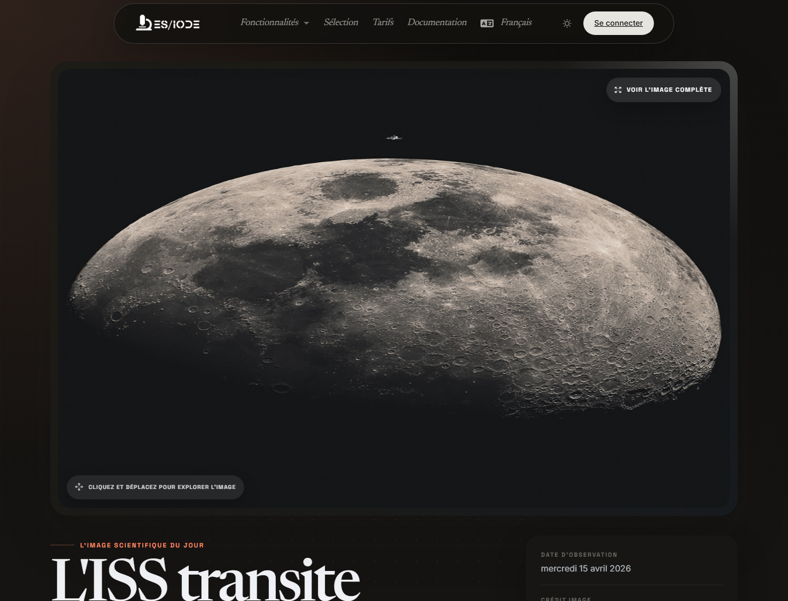

# Image de **science**

**Image de science** met en avant un visuel scientifique éditorialisé: image astronomique, photographie expérimentale, observation technique, archive institutionnelle ou illustration issue d'une source scientifique publique. L'objectif n'est pas seulement esthétique: cette page aide à relier une observation visuelle à son contexte scientifique, à sa source et aux pistes de recherche associées.

```text
https://ethicseido.com/Iode/ScienceImage
```



## Ce que la page apporte

- Une image scientifique du jour, affichée dans un espace de lecture immersif.
- Un titre éditorial et une date d'observation ou de publication lorsque l'information est disponible.
- Le crédit de l'image et, selon la source, un accès au média original ou à une ressource scientifique liée.
- Une navigation vers la recherche scientifique ES/IODE pour approfondir le phénomène, l'objet ou le domaine représenté.

## Méthode d'utilisation

Commencez par observer l'image sans interprétation immédiate: structure, échelle, contraste, orientation, légende visible, instruments ou marqueurs. Consultez ensuite le titre, la date et le crédit afin d'identifier le type de source et le contexte de production.

Pour une utilisation scientifique, formulez ensuite une ou deux questions vérifiables:

- Quel phénomène est représenté?
- Quelle méthode d'observation ou quel instrument a produit l'image?
- L'image illustre-t-elle une observation brute, une reconstruction, une composition ou une visualisation?
- Quelles publications récentes permettent de replacer cette observation dans l'état de l'art?

## Approfondir dans ES/IODE

Utilisez les termes importants de l'image dans la recherche d'articles scientifiques: nom de mission, objet céleste, pathologie, technique d'imagerie, matériau, organisme, instrument ou institution source. Lorsque le sujet relève du vivant ou de la santé, vérifiez aussi si des essais cliniques ou des études observationnelles sont disponibles.

## Prudence d'interprétation

Une image scientifique peut être spectaculaire sans constituer une preuve isolée. Vérifiez toujours la source, le protocole d'acquisition, les traitements appliqués, la date et le contexte disciplinaire. Lorsque l'image vient d'une agence ou d'une archive publique, consultez le média original avant de l'utiliser dans une communication scientifique.

!!! info
    Cette documentation décrit le parcours public visible. Les écrans protégés par compte ou par offre ne sont pas détaillés sans accès de test.
