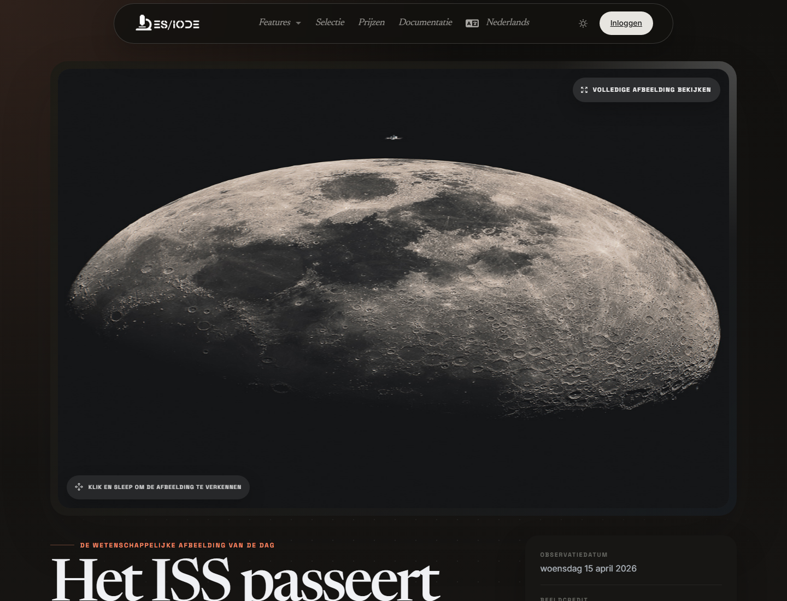

# **Wetenschappelijk beeld**

**Science picture** belicht een wetenschappelijke visual met redactionele context: astronomisch beeld, experimentele foto, technische observatie, institutioneel archiefmateriaal of illustratie uit een openbare wetenschappelijke bron. Het doel is niet alleen visueel: de pagina helpt een observatie te verbinden met haar wetenschappelijke context, bron en mogelijke onderzoeksrichtingen.

```text
https://ethicseido.com/Iode/ScienceImage
```



## Wat de pagina biedt

- Een wetenschappelijk beeld van de dag in een immersieve leesomgeving.
- Een redactionele titel en, wanneer beschikbaar, een observatie- of publicatiedatum.
- Beeldcredit en afhankelijk van de bron toegang tot het originele medium of een verwante wetenschappelijke bron.
- Een route naar de ES/IODE-zoekfunctie om het weergegeven fenomeen, object of vakgebied verder te onderzoeken.

## Werkwijze

Observeer het beeld eerst zonder directe interpretatie: structuur, schaal, contrast, oriëntatie, zichtbare labels, instrumenten of markeringen. Bekijk daarna titel, datum en credit om het brontype en de productiecontext te bepalen.

Voor wetenschappelijk gebruik formuleer je één of twee verifieerbare vragen:

- Welk fenomeen wordt weergegeven?
- Welke observatiemethode of welk instrument heeft het beeld geproduceerd?
- Is het beeld een ruwe observatie, reconstructie, compositie of visualisatie?
- Welke recente publicaties plaatsen deze observatie in de huidige stand van het vakgebied?

## Verdiepen in ES/IODE

Gebruik kerntermen uit het beeld in de zoekfunctie voor wetenschappelijke artikelen: missienaam, hemelobject, ziekte, beeldvormingstechniek, materiaal, organisme, instrument of broninstelling. Bij levenswetenschappelijke of medische onderwerpen kun je ook nagaan of klinische onderzoeken of observationele studies beschikbaar zijn.

## Voorzichtig interpreteren

Een wetenschappelijk beeld kan indrukwekkend zijn zonder op zichzelf bewijs te vormen. Controleer altijd bron, acquisitieprotocol, bewerkingsstappen, datum en disciplinaire context. Raadpleeg bij beelden uit een agentschap of openbaar archief het originele medium voordat je het in wetenschappelijke communicatie gebruikt.

!!! info
    Deze documentatie beschrijft de openbaar zichtbare flow. Account- of aanbodgebaseerde schermen worden zonder testtoegang niet gedetailleerd.
