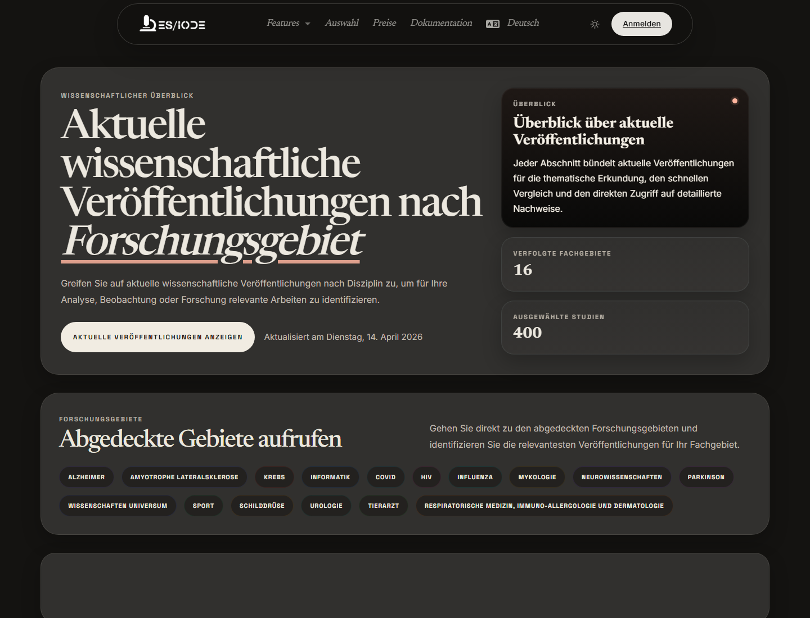

# **Wissenschaftliches Journal**

Das ES/IODE-Wissenschaftsjournal präsentiert regelmäßig ausgewählte Publikationen nach Forschungsfeldern. Es hilft, die Entwicklung eines Fachgebiets zu verfolgen, aktuelle Artikel zu entdecken und einen Einstieg für Monitoring oder Bibliografieaufbau zu schaffen.

```text
https://ethicseido.com/en/Iode/Selection
```



## Organisation nach Fachgebieten

Die öffentliche Seite zeigt Bereiche wie Alzheimer, Krebs, Informatik und KI, Neurowissenschaften, Parkinson, Universumswissenschaften, Sport, Schilddrüse, Urologie, Veterinärmedizin oder weitere Kategorien je nach Auswahl. Diese Gruppierung erleichtert die Quersichtung eines aktuellen Korpus.

## Auswahl erkunden

Nutzen Sie **Explore** oder sichtbare Kategorien. Prüfen Sie Titel, Datum, Kategorie, Auszug und Schlüsselwörter. Öffnen Sie Details, wenn Zusammenfassung, Quelle oder Metadaten relevant sind.

## Monitoring-Methode

Dokumentieren Sie Datum der Auswahl, relevante Kategorien, Vergleich mehrerer Artikel, wichtige Schlüsselwörter und behalten Sie nur Referenzen, deren Quelle und Inhalt Ihre Frage beantworten.

## Methodische Vorsicht

Eine redaktionelle Auswahl ist kein systematisches Review. Sie unterstützt Entdeckung, ersetzt aber keine explizite Suchstrategie, Ein- und Ausschlusskriterien oder kritische Qualitätsbewertung.
