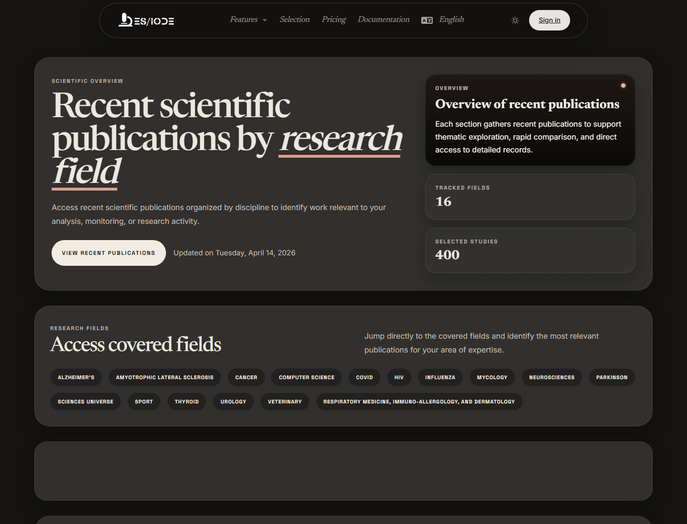

# Scientific **Journal**

The ES/IODE scientific journal presents a regular selection of publications organized by research field. It helps follow field evolution, spot recent articles, and create an entry point for monitoring or bibliography building.

```text
https://ethicseido.com/en/Iode/Selection
```



## Organization by field

The public page displays fields such as Alzheimer's, cancer, computer science and AI, neuroscience, Parkinson's, universe sciences, sport, thyroid, urology, veterinary topics, or other categories depending on the available selection. These groups support cross-reading of a recent corpus.

## Explore a selection

Use **Explore** or visible categories to browse publications. For each card, review title, date, category, excerpt, and keywords. Open the public detail when you need to verify abstract, source, or metadata.

## Monitoring method

For structured scientific monitoring:

- record the date of the consulted selection;
- identify categories relevant to your topic;
- compare several articles from the same field;
- transfer important keywords into article search;
- keep only references whose source and content answer your question.

## Methodological caution

An editorial selection is not a systematic review. It supports discovery, but does not replace an explicit search strategy, inclusion and exclusion criteria, or critical assessment of methodological quality.
