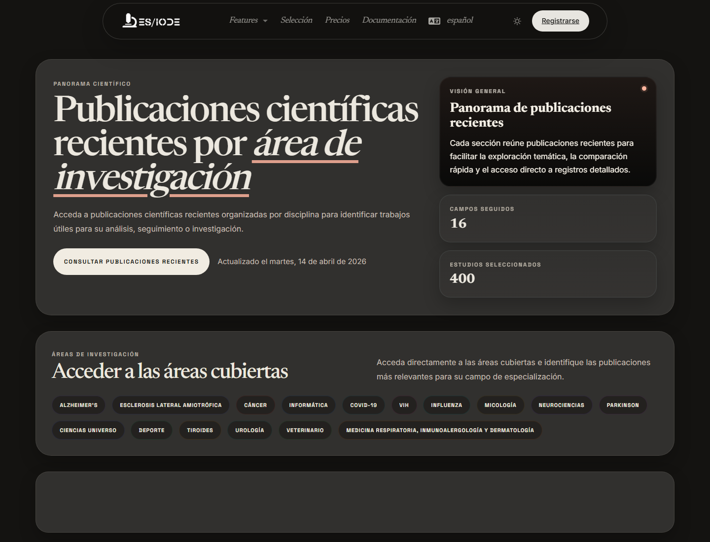

# Revista **científica**

La revista científica de ES/IODE presenta una selección regular de publicaciones organizadas por campo de investigación. Ayuda a seguir la evolución de un área, detectar artículos recientes y crear un punto de entrada para vigilancia o bibliografía.

```text
https://ethicseido.com/en/Iode/Selection
```



## Organización por campos

La página pública muestra campos como Alzheimer, cáncer, informática e IA, neurociencias, Parkinson, ciencias del universo, deporte, tiroides, urología, veterinaria u otras categorías según la selección disponible. Estos agrupamientos facilitan una lectura transversal de un corpus reciente.

## Explorar una selección

Usa **Explore** o las categorías visibles para recorrer publicaciones. En cada tarjeta, revisa título, fecha, categoría, extracto y palabras clave. Abre el detalle público cuando necesites verificar resumen, fuente o metadatos.

## Método de vigilancia

Para una vigilancia científica estructurada:

- registra la fecha de la selección consultada;
- identifica las categorías relevantes para tu tema;
- compara varios artículos del mismo campo;
- transfiere palabras clave importantes a la búsqueda de artículos;
- conserva solo referencias cuya fuente y contenido respondan a tu pregunta.

## Precaución metodológica

Una selección editorial no es una revisión sistemática. Ayuda al descubrimiento, pero no sustituye una estrategia de búsqueda explícita, criterios de inclusión y exclusión ni una evaluación crítica de la calidad metodológica.
