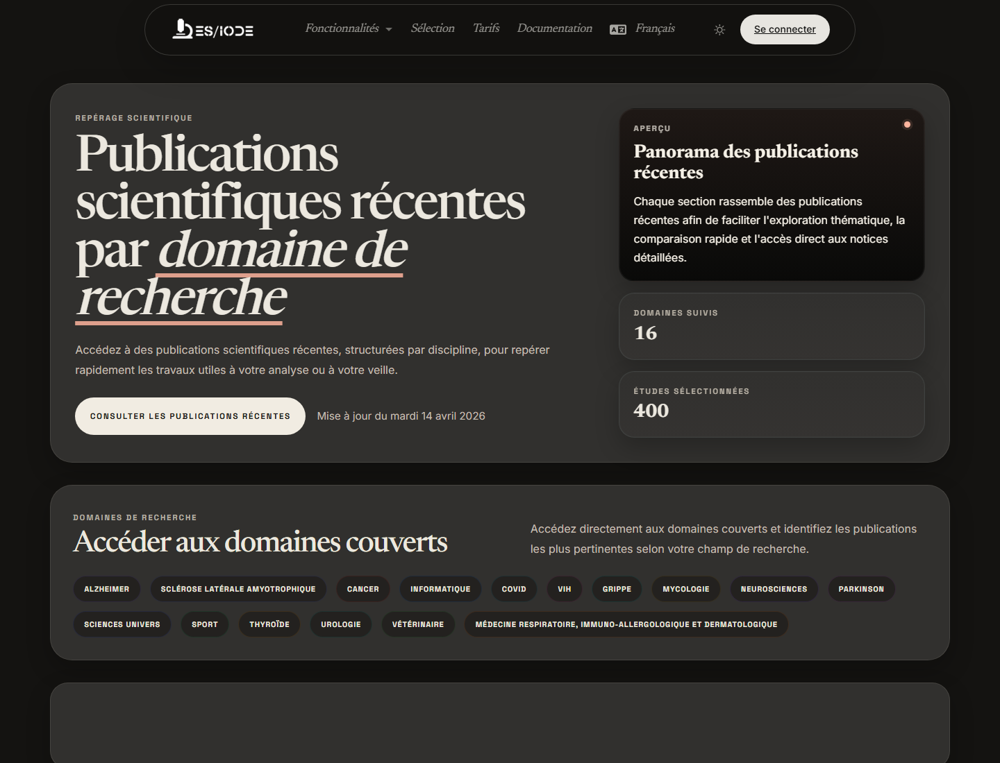

# Revue **scientifique**

La revue scientifique ES/IODE présente une sélection régulière de publications organisées par champ de recherche. Elle aide à suivre l'évolution d'un domaine, à repérer des articles récents et à constituer un point d'entrée pour une veille ou une bibliographie.

```text
https://ethicseido.com/en/Iode/Selection
```



## Organisation par domaines

La page publique affiche des domaines comme Alzheimer, cancer, informatique et IA, neurosciences, Parkinson, sciences de l'univers, sport, thyroïde, urologie, vétérinaire ou d'autres catégories selon la sélection disponible. Ces regroupements facilitent une lecture transversale d'un corpus récent.

## Explorer une sélection

Utilisez **Explore** ou les catégories visibles pour parcourir les publications. Pour chaque carte, examinez le titre, la date, la catégorie, l'extrait et les mots-clés. Ouvrez le détail public lorsque vous souhaitez vérifier le résumé, la source ou les métadonnées.

## Méthode de veille

Pour une veille scientifique structurée:

- notez la date de la sélection consultée;
- identifiez les catégories pertinentes pour votre sujet;
- comparez plusieurs articles d'un même domaine;
- transférez les mots-clés importants dans la recherche d'articles;
- conservez uniquement les références dont la source et le contenu répondent à votre question.

## Prudence méthodologique

Une sélection éditoriale n'est pas une revue systématique. Elle aide à découvrir des travaux, mais ne remplace pas une stratégie de recherche explicite, des critères d'inclusion et d'exclusion, ni une évaluation critique de la qualité méthodologique.
