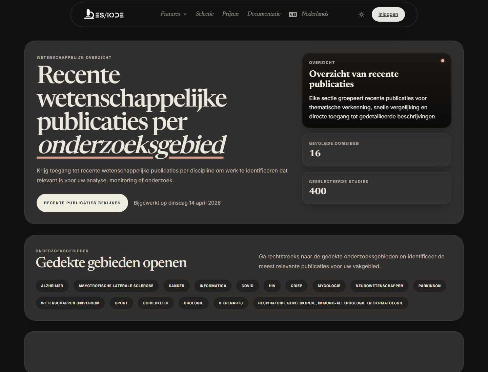

# **Wetenschappelijk tijdschrift**

Het ES/IODE wetenschappelijk tijdschrift presenteert regelmatig geselecteerde publicaties per onderzoeksveld. Het helpt de evolutie van een domein te volgen, recente artikelen te ontdekken en een startpunt te vormen voor monitoring of bibliografie.

```text
https://ethicseido.com/en/Iode/Selection
```



## Organisatie per onderzoeksveld

De openbare pagina toont velden zoals Alzheimer, kanker, informatica en AI, neurowetenschappen, Parkinson, universumwetenschappen, sport, schildklier, urologie, diergeneeskunde of andere categorieën afhankelijk van de selectie. Deze groepering ondersteunt dwarslezing van een recent corpus.

## Een selectie verkennen

Gebruik **Explore** of zichtbare categorieën. Bekijk titel, datum, categorie, fragment en trefwoorden. Open details wanneer samenvatting, bron of metadata relevant zijn.

## Monitoringmethode

Noteer de datum van de selectie, relevante categorieën, vergelijking tussen artikelen, belangrijke trefwoorden en behoud alleen referenties waarvan bron en inhoud je vraag beantwoorden.

## Methodologische voorzichtigheid

Een redactionele selectie is geen systematische review. Ze ondersteunt ontdekking, maar vervangt geen expliciete zoekstrategie, inclusie- en exclusiecriteria of kritische kwaliteitsbeoordeling.
