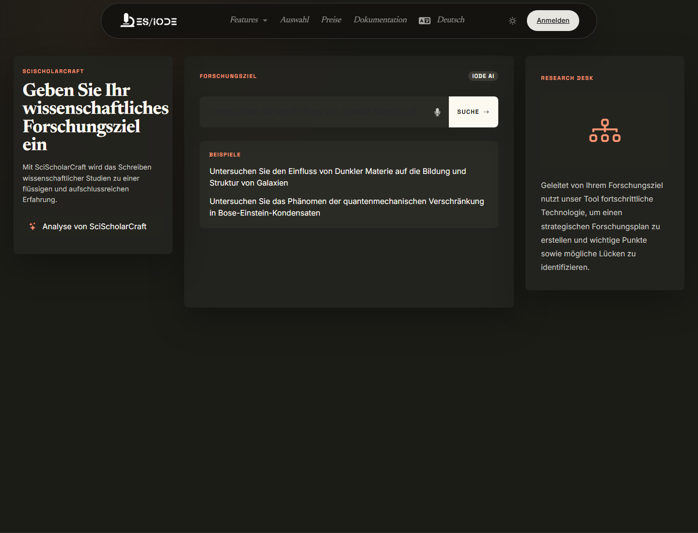

# **SciScholarCraft**

SciScholarCraft unterstützt die Strukturierung eines wissenschaftlichen Forschungsziels. Es hilft, aus einer allgemeinen Absicht konkrete Arbeitsrichtungen abzuleiten: Hypothesen, Studienauswahl, Schreibplan und Projektorganisation, sofern das aktive Angebot dies ermöglicht.

```text
https://ethicseido.com/Iode/SciScholarCraft
```



## Forschungsziel formulieren

Die Qualität der Ergebnisse hängt stark von der Anfangsformulierung ab. Verwenden Sie möglichst einen vollständigen Satz mit Fachgebiet, Untersuchungsobjekt, Population oder System, zu analysierender Beziehung und gewünschtem Ergebnis.

```text
Bewertung der Rolle von Neuroinflammation in der frühen Progression der Alzheimer-Krankheit und Identifikation geeigneter Biomarker für ein narratives Review.
```

Vermeiden Sie zu kurze oder mehrdeutige Anfragen. Bei breiten Themen beginnen Sie explorativ und verfeinern anhand der vorgeschlagenen Hypothesen oder Studien.

## Generierungsaktionen

Nach der Analyse wird der Aufgabenbereich verfügbar. Es kann jeweils nur eine Generierungsaktion gestartet werden.

- **Hypothesengenerierung**: erzeugt Arbeitshypothesen zur Prüfung, Widerlegung oder Präzisierung.
- **Auswahl wissenschaftlicher Studien**: schlägt Studien für einen initialen Korpus vor.
- **Generierung eines Schreibplans**: strukturiert eine wissenschaftliche Argumentation, etwa für Review, Einführung oder Protokoll.

Die Ausgaben sind Strukturierungshilfen, keine endgültigen Ergebnisse. Hypothesen müssen mit Literatur und verfügbaren Daten abgeglichen werden.

## Wissenschaftliche Nutzung

SciScholarCraft ist nützlich, um Forschungsfragen zu klären, Unterthemen zu identifizieren, Artikel- oder Berichtsgliederungen vorzubereiten, theoretische Perspektiven zu vergleichen und Lücken in einem Korpus sichtbar zu machen.

## Projekte und Speichern

!!! warning "Academic-Angebot erforderlich"
    Projektfunktionen wie Speichern, Öffnen, Löschen oder Erstellen eines Projekts erfordern Anmeldung und Academic-Angebot, wenn sie nicht öffentlich verfügbar sind.

## Validierung

Für akademische Arbeiten prüfen Sie immer Primärquellen, Studiendesign, mögliche Biases und Konsistenz zwischen Hypothesen, Daten und Schlussfolgerung.
