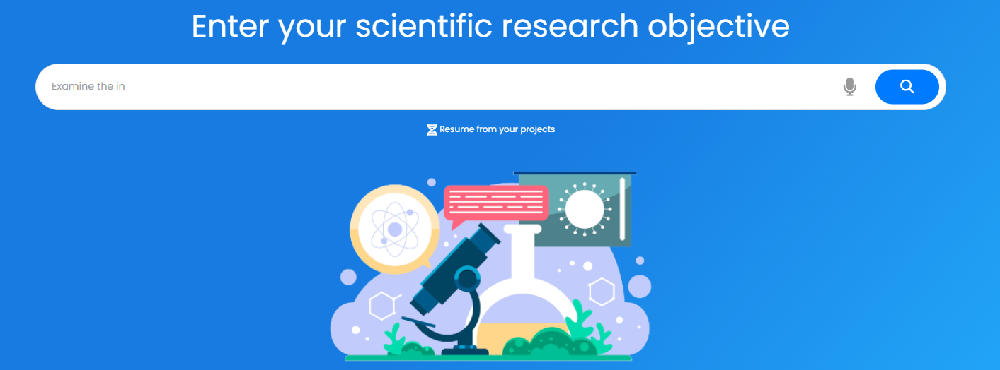

## **Erste Schritte**

Um die Funktion __ES/IODE's SciScholarCraft__ zu nutzen, geben Sie einen möglichst vollständigen und relevanten Satz zu Ihrem wissenschaftlichen Forschungsziel in die Suchleiste in der Mitte der Seite ein.

SciScholarCraft wird Ihr Forschungsziel analysieren und mehrere Generierungsaktionen vorschlagen.

Registrieren Sie sich für ein kostenloses Konto, um erweiterte Funktionen zu nutzen.

__ES/IODE__ steht Ihnen bei Ihrer Suche nach wissenschaftlichem Wissen zur Seite.

Bei Fragen oder Kommentaren können Sie uns gerne kontaktieren.

Viel Erfolg bei der Suche! :rocket:

## **Generierung von Hypothesen**

Für die Funktion "Generierung von Hypothesen" müssen Sie zunächst ein Forschungsziel in die Suchleiste eingeben und das Ergebnis der SciScholarCraft-Analyse erhalten.

Dann haben Sie Zugriff auf den folgenden Abschnitt unter Analyse:

Klicken Sie anschließend auf die Schaltfläche "Generierung von Hypothesen", um den Generierungsvorgang zu starten.

### **Kopieren der generierten Hypothesen in die Zwischenablage**

Im Abschnitt für Hypothesen klicken Sie auf das Symbol :fontawesome-solid-copy:, das sich oben rechts befindet.

## **Auswahl wissenschaftlicher Studien**

Für die Funktion "Auswahl wissenschaftlicher Studien" müssen Sie zunächst ein Forschungsziel in die Suchleiste eingeben und das Ergebnis der SciScholarCraft-Analyse erhalten.

Dann haben Sie Zugriff auf den folgenden Abschnitt unter Analyse:

Klicken Sie anschließend auf die Schaltfläche "Auswahl wissenschaftlicher Studien", um den Generierungsvorgang zu starten.

### **Kopieren der wissenschaftlichen Studien in die Zwischenablage**

Im Abschnitt für wissenschaftliche Studien klicken Sie auf das Symbol :fontawesome-solid-copy:, das sich oben rechts befindet.

## **Generierung eines Schreibplans**

Für die Funktion "Generierung eines Schreibplans" müssen Sie zunächst ein Forschungsziel in die Suchleiste eingeben und das Ergebnis der SciScholarCraft-Analyse erhalten.

Dann haben Sie Zugriff auf den folgenden Abschnitt unter Analyse:

Klicken Sie anschließend auf die Schaltfläche "Generierung eines Schreibplans", um den Generierungsvorgang zu starten.

### **Export des Schreibplans in Word**

Im Abschnitt für den Schreibplan klicken Sie auf das Symbol :fontawesome-solid-file-export:, das sich oben rechts befindet.

### **Kopieren des generierten Schreibplans in die Zwischenablage**

Im Abschnitt für den Schreibplan klicken Sie auf das Symbol :fontawesome-solid-copy:, das sich oben rechts befindet.

## **Schnellzugriffsleiste**

!!! Info
    Die Schnellzugriffsleiste ist ab Version 3.2 von ES/IODE verfügbar und steht auf Geräten mit einer Bildschirmbreite von mehr als **800px** zur Verfügung, wie Tablets, Desktops und bestimmte Mobilgeräte im Querformat.

Die Leiste erscheint nach der Generierung der Analyse des SciScholarCraft-Ziels oder direkt nach dem Öffnen eines vorhandenen Projekts.

Sie entspricht der Abbildung unten:

Sie befindet sich links von den Generierungsbereichen.

## **Auswahl des Forschungsprojekts**

!!! warning "Academic Angebot erforderlich"

    **Diese Funktion ist nur zugänglich, wenn Sie mit einem Konto verbunden sind (auf unserer Plattform erstellt) und über das Academic Angebot verfügen**

Es stehen Ihnen 2 Möglichkeiten zur Verfügung:

- Klicken Sie auf das Symbol :fontawesome-solid-dna: unter der Suchleiste.

- Oder klicken Sie auf das Symbol :fontawesome-solid-folder-open: in der Schnellzugriffsleiste.

Dann können Sie die Liste Ihrer Projekte anzeigen (wenn Sie bereits welche gespeichert haben).

## **Speichern Sie Ihr Projekt**

!!! warning "Academic Angebot erforderlich"

    **Diese Funktion ist nur zugänglich, wenn Sie mit einem Konto verbunden sind (auf unserer Plattform erstellt) und über das Academic Angebot verfügen**

!!! Info

    In SciScholarCraft können Sie bis zu 10 Projekte speichern.

Es stehen Ihnen 2 Möglichkeiten zur Verfügung:

- Klicken Sie auf die Schaltfläche :fontawesome-solid-cloud-arrow-up: "Speichern" unter den Generierungsbereichen.

- Alternativ klicken Sie auf das Symbol :fontawesome-solid-cloud-arrow-up: in der Schnellzugriffsleiste.

Eine Benachrichtigung bestätigt, ob das Projekt gespeichert wurde.

## **Löschen Sie Ihr Projekt**

!!! warning "Academic Angebot erforderlich"

    **Diese Funktion ist nur zugänglich, wenn Sie mit einem Konto verbunden sind (auf unserer Plattform erstellt) und über das Academic Angebot verfügen**

Es stehen Ihnen 2 Möglichkeiten zur Verfügung:

1. Klicken Sie auf das Symbol :fontawesome-solid-dna: unter der Suchleiste, 
    1. Das Menü **Auswahl des Forschungsprojekts** wird angezeigt. Klicken Sie dann auf die Schaltfläche  in der Zeile des Projekts, das Sie löschen möchten.
    2. Das Aktionsmenü wird angezeigt; klicken Sie dann auf die Schaltfläche .

2. Alternativ klicken Sie auf das Symbol :fontawesome-solid-cloud-arrow-up: in der Schnellzugriffsleiste,
    1. Das Menü **Auswahl des Forschungsprojekts** wird angezeigt, klicken Sie dann auf die Schaltfläche  in der Zeile des Projekts, das Sie löschen möchten.
    2. Das Aktionsmenü wird angezeigt, klicken Sie dann auf die Schaltfläche .

Eine Benachrichtigung bestätigt, ob das Projekt gelöscht wurde.

## **Öffnen Sie Ihr Projekt**

!!! warning "Academic Angebot erforderlich"

    **Diese Funktion ist nur zugänglich, wenn Sie mit einem Konto verbunden sind (auf unserer Plattform erstellt) und über das Academic Angebot verfügen**

Es stehen Ihnen 2 Möglichkeiten zur Verfügung:

1. Klicken Sie auf das Symbol :fontawesome-solid-dna: unter der Suchleiste, 
    1. Das Menü **Auswahl des Forschungsprojekts** wird angezeigt. Klicken Sie dann auf die Schaltfläche  in der Zeile des Projekts, das Sie öffnen möchten.
    2. Das Aktionsmenü wird angezeigt; klicken Sie dann auf die Schaltfläche .

2. Alternativ klicken Sie auf das Symbol :fontawesome-solid-cloud-arrow-up: in der Schnellzugriffsleiste,
    1. Das Menü **Auswahl des Forschungsprojekts** wird angezeigt, klicken Sie dann auf die Schaltfläche  in der Zeile des Projekts, das Sie öffnen möchten.
    2. Das Aktionsmenü wird angezeigt, klicken Sie dann auf die Schaltfläche .

## **Neues Projekt**

!!! warning "Academic Angebot erforderlich"

    **Diese Funktion ist nur zugänglich, wenn Sie mit einem Konto verbunden sind (auf unserer Plattform erstellt) und über das Academic Angebot verfügen**

Klicken Sie auf das Symbol :fontawesome-solid-plus: in der Schnellzugriffsleiste.