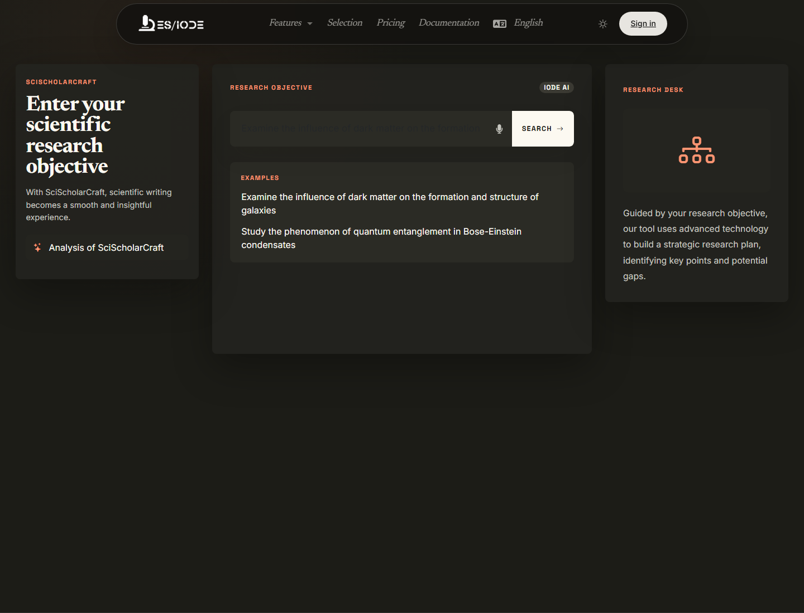

# **SciScholarCraft**

SciScholarCraft supports the structuring of a scientific research objective. It helps move from a broad intention to working directions: hypotheses, study selection, writing plan, and project organization when enabled by the active offer.

```text
https://ethicseido.com/Iode/SciScholarCraft
```



## Formulate a research objective

Output quality depends strongly on the initial formulation. Prefer a complete sentence that states the field, object of study, population or system, relationship to analyze, and expected output.

Example:

```text
Assess the role of neuroinflammation in early Alzheimer's disease progression and identify biomarkers useful for a narrative review.
```

Avoid queries that are too short or ambiguous. If the topic is broad, start with an exploratory question and refine it from the proposed hypotheses or studies.

## Generation actions

After analysis, the task section becomes available. Only one generation action can be launched at a time.

- **Hypothesis generation**: produces working hypotheses to examine, reject, or refine.
- **Scientific study selection**: suggests studies related to the topic to build an initial corpus.
- **Writing plan generation**: structures a scientific argument, for example for a review, introduction, or protocol.

Each generation should be read as a structuring aid, not a final result. Hypotheses must be compared with the literature and available data.

## Scientific use

SciScholarCraft is useful to:

- clarify a research question before literature review;
- identify subtopics or mechanisms to explore;
- prepare an article or report outline;
- compare theoretical angles;
- identify gaps in a corpus.

## Projects and saving

The quick access sidebar helps open, save, or create projects.

!!! warning "Academic offer required"
    Project features such as saving, opening, deleting, or creating a project require sign-in and the Academic offer when not publicly available.

## Usage limits and validation

The public site displays limit messages when the maximum number of searches, hypotheses, or study selections is reached. Exact limits depend on the active offer.

For academic work, always verify primary references, study methods, possible biases, and consistency between hypotheses, data, and conclusion.
