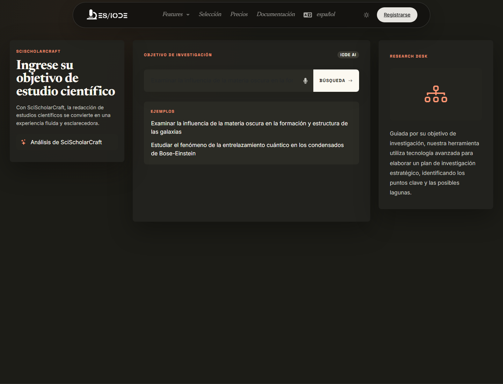

# **SciScholarCraft**

SciScholarCraft acompaña la estructuración de un objetivo de investigación científica. Ayuda a pasar de una intención general a líneas de trabajo: hipótesis, selección de estudios, plan de escritura y organización de proyecto cuando la oferta activa lo permite.

```text
https://ethicseido.com/Iode/SciScholarCraft
```



## Formular un objetivo de investigación

La calidad de los resultados depende mucho de la formulación inicial. Es preferible una frase completa que indique el campo, el objeto de estudio, la población o sistema, la relación que se quiere analizar y el tipo de resultado esperado.

Ejemplo:

```text
Evaluar el papel de la neuroinflamación en la progresión temprana de la enfermedad de Alzheimer e identificar biomarcadores útiles para una revisión narrativa.
```

Evita consultas demasiado cortas o ambiguas. Si el tema es amplio, empieza con una pregunta exploratoria y afina a partir de las hipótesis o estudios propuestos.

## Acciones de generación

Tras el análisis, la sección de tareas queda disponible. Solo se puede lanzar una acción de generación a la vez.

- **Generación de hipótesis**: produce hipótesis de trabajo para examinar, refutar o precisar.
- **Selección de estudios científicos**: sugiere estudios relacionados con el tema para construir un corpus inicial.
- **Generación de un plan de escritura**: estructura una argumentación científica, por ejemplo para una revisión, introducción o protocolo.

Cada generación debe leerse como ayuda de estructuración, no como resultado definitivo. Las hipótesis deben contrastarse con la literatura y los datos disponibles.

## Uso científico

SciScholarCraft es especialmente útil para:

- clarificar una pregunta antes de una revisión bibliográfica;
- identificar subtemas o mecanismos a explorar;
- preparar el esquema de un artículo o informe;
- comparar varios enfoques teóricos;
- detectar lagunas en un corpus.

## Proyectos y guardado

La barra lateral de acceso rápido ayuda a abrir, guardar o crear proyectos.

!!! warning "Oferta Academic requerida"
    Las funciones de proyecto, como guardar, abrir, eliminar o crear un proyecto, requieren iniciar sesión y la oferta Academic cuando no están disponibles públicamente.

## Límites de uso y validación

El sitio público muestra mensajes de límite cuando se alcanza el número máximo de búsquedas, hipótesis o selecciones de estudios. Los límites exactos dependen de la oferta activa.

Para un trabajo académico, verifica siempre referencias primarias, métodos de los estudios, posibles sesgos y coherencia entre hipótesis, datos y conclusión.
