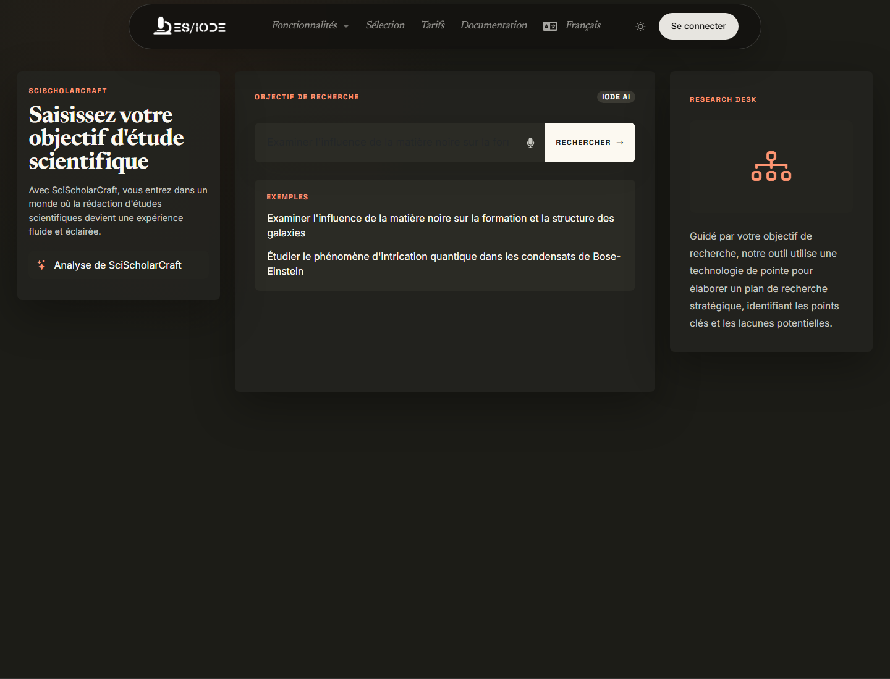

# **SciScholarCraft**

SciScholarCraft accompagne la structuration d'un objectif de recherche scientifique. Il aide à passer d'une intention générale à des pistes de travail: hypothèses, sélection d'études, plan d'écriture et organisation de projet lorsque l'offre active le permet.

```text
https://ethicseido.com/Iode/SciScholarCraft
```



## Formuler un objectif de recherche

La qualité des résultats dépend fortement de la formulation initiale. Privilégiez une phrase complète qui indique le domaine, l'objet étudié, la population ou le système, la relation à analyser et le type de sortie attendu.

Exemple de formulation:

```text
Évaluer le rôle de la neuroinflammation dans la progression précoce de la maladie d'Alzheimer et identifier les biomarqueurs utiles pour une revue narrative.
```

Évitez les requêtes trop courtes ou ambiguës. Si le sujet est vaste, commencez par une question exploratoire puis affinez à partir des hypothèses ou études proposées.

## Actions de génération

Après l'analyse, la section des tâches devient disponible. Une seule action de génération peut être lancée à la fois.

- **Génération d'hypothèses**: produit des hypothèses de travail à examiner, réfuter ou préciser.
- **Sélection d'études scientifiques**: propose des études liées au sujet pour construire un corpus initial.
- **Génération d'un plan d'écriture**: structure une argumentation scientifique, par exemple pour une revue, une introduction ou un protocole.

Chaque génération doit être relue comme une aide à la structuration, pas comme un résultat définitif. Les hypothèses doivent être confrontées à la littérature et aux données disponibles.

## Utilisation scientifique

SciScholarCraft est particulièrement utile pour:

- clarifier une question de recherche avant une revue bibliographique;
- identifier des sous-thèmes ou mécanismes à explorer;
- préparer un plan d'article ou de rapport;
- comparer plusieurs angles théoriques;
- repérer des lacunes dans un corpus.

## Projets et sauvegarde

La barre latérale d'accès rapide facilite l'ouverture, la sauvegarde ou la création de projets.

!!! warning "Offre Academic requise"
    Les fonctions de projet, comme enregistrer, ouvrir, supprimer ou créer un projet, nécessitent une connexion et l'offre Academic lorsqu'elles ne sont pas disponibles publiquement.

## Limites d'usage et validation

Le site public affiche des messages de limite lorsque le nombre maximal de recherches, d'hypothèses ou de sélections d'études est atteint. Les limites exactes dépendent de l'offre active.

Pour un travail académique, vérifiez toujours les références primaires, la méthode des études retenues, les biais possibles et la cohérence entre hypothèses, données et conclusion.
