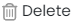

## **Premiers pas**

Pour commencer à utiliser la fonctionnalité __SciScholarCraft__ d'__ES/IODE__, saisissez une phrase aussi complète et pertinente que possible concernant votre objectif de recherche scientifique dans la barre de recherche au centre de la page.

SciScholarCraft analysera votre objectif de recherche et suggérera plusieurs actions de génération.

Inscrivez-vous pour un compte gratuit afin de profiter des fonctionnalités avancées.

__ES/IODE__ est là pour vous aider dans votre quête de connaissances scientifiques.

N'hésitez pas à nous contacter si vous avez des questions ou des commentaires.

Bonne recherche ! :rocket:

## **Génération d'hypothèses**

Pour la fonction "Génération d'hypothèses", vous devez d'abord saisir un objectif de recherche dans la barre de recherche et obtenir le résultat de l'analyse de SciScholarCraft.

Ensuite, vous aurez accès à la section suivante, sous l'analyse :

Ensuite, cliquez sur le bouton "Génération d'hypothèses", l'action de la génération commencera.

### **Copier la génération d'hypothèses dans le presse-papiers**

Dans la section des hypothèses, cliquez sur l'icône :fontawesome-solid-copy: située en haut à droite.

## **Sélection d'études scientifiques**

Pour la fonction "Sélection d'études scientifiques", vous devez d'abord saisir un objectif de recherche dans la barre de recherche et obtenir le résultat de l'analyse de SciScholarCraft.

Ensuite, vous aurez accès à la section suivante, sous l'analyse :

Ensuite, cliquez sur le bouton "Sélection d'études scientifiques", l'action de la génération commencera.

### **Copier les études scientifiques dans le presse-papiers**

Dans la section des études scientifiques, cliquez sur l'icône :fontawesome-solid-copy: située en haut à droite.

## **Génération d'un plan d'écriture**

Pour la fonction "Génération d'un plan d'écriture", vous devez d'abord saisir un objectif de recherche dans la barre de recherche et obtenir le résultat de l'analyse de SciScholarCraft.

Ensuite, vous aurez accès à la section suivante, sous l'analyse :

Ensuite, cliquez sur le bouton "Génération d'un plan d'écriture", l'action de la génération commencera.

### **Exporter le plan d'écriture généré vers Word**

Dans la section du plan d'écriture, cliquez sur l'icône :fontawesome-solid-file-export: située en haut à droite.

### **Copier le plan d'écriture généré dans le presse-papiers**

Dans la section du plan d'écriture, cliquez sur l'icône :fontawesome-solid-copy: située en haut à droite.

## **Barre latérale d'accès rapide**

!!! info
    La barre latérale d'accès rapide est disponible à partir de la version 3.2 d'ES/IODE. Elle est accessible sur les appareils avec une largeur de résolution supérieure à **800 pixels**, tels que les tablettes, les ordinateurs de bureau et certains mobiles en mode paysage.

La barre apparaît après la génération de l'analyse de l'objectif SciScholarCraft ou directement après l'ouverture d'un projet existant.

Elle correspond à la visualisation ci-dessous :

Elle est située à gauche des sections de génération.

## **Sélection de projet de recherche**

!!! warning "Offre Academic requise"

    **Cette fonction n'est accessible que si vous êtes connecté à un compte (créé sur notre plateforme) et que vous disposez de l'Offre Academic**

Deux possibilités s'offrent à vous :

- Cliquez sur l'icône :fontawesome-solid-dna: sous la barre de recherche

- Ou cliquez sur l'icône :fontawesome-solid-folder-open: dans la barre latérale d'accès rapide

vous pourrez alors consulter la liste de vos projets (si vous en avez déjà enregistré).

## **Enregistrer votre projet**

!!! warning "Offre Academic requise"

    **Cette fonction n'est accessible que si vous êtes connecté à un compte (créé sur notre plateforme) et que vous disposez de l'Offre Academic**

!!! info

    Dans SciScholarCraft, vous pouvez enregistrer jusqu'à 10 projets.

Deux possibilités s'offrent à vous :

- Cliquez sur le bouton :fontawesome-solid-cloud-arrow-up: Enregistrer, sous les sections de génération

- Ou cliquez sur l'icône :fontawesome-solid-cloud-arrow-up: dans la barre latérale d'accès rapide

Une notification confirmera si le projet a été enregistré.

## **Supprimer votre projet**

!!! warning "Offre Academic requise"

    **Cette fonction n'est accessible que si vous êtes connecté à un compte (créé sur notre plateforme) et que vous disposez de l'Offre Academic**

Deux possibilités s'offrent à vous :

1.  Cliquez sur l'icône :fontawesome-solid-dna: sous la barre de recherche,
    1. Le menu **Sélection de projet de recherche** apparaîtra. Ensuite, cliquez sur le bouton  sur la ligne du projet que vous souhaitez supprimer.
    2. Le menu d'action apparaîtra ; ensuite, cliquez sur le bouton .

2. Ou cliquez sur l'icône :fontawesome-solid-cloud-arrow-up: dans la barre latérale d'accès rapide,
    1. Le menu **Sélection de projet de recherche** apparaîtra, puis cliquez sur le bouton  sur la ligne du projet que vous souhaitez supprimer.
    2. Le menu d'action apparaîtra, puis cliquez sur le bouton .

Une notification confirmera si le projet a été supprimé.

## **Ouvrir votre projet**

!!! warning "Offre Academic requise"

    **Cette fonction n'est accessible que si vous êtes connecté à un compte (créé sur notre plateforme) et que vous disposez de l'Offre Academic**

Deux possibilités s'offrent à vous :

1.  Cliquez sur l'icône :fontawesome-solid-dna: sous la barre de recherche,
    1. Le menu **Sélection de projet de recherche** apparaîtra. Ensuite, cliquez sur le bouton  sur la ligne du projet que vous souhaitez ouvrir.
    2. Le menu d'action apparaîtra ; ensuite, cliquez sur le bouton .

2. Ou cliquez sur l'icône :fontawesome-solid-cloud-arrow-up: dans la barre latérale d'accès rapide,
    1. Le menu **Sélection de projet de recherche** apparaîtra, puis cliquez sur le bouton  sur la ligne du projet que vous souhaitez ouvrir.
    2. Le menu d'action apparaîtra, puis cliquez sur le bouton .
    
## **Nouveau projet**

!!! warning "Offre Academic requise"

    **Cette fonction n'est accessible que si vous êtes connecté à un compte (créé sur notre plateforme) et que vous disposez de l'Offre Academic**

Cliquez sur l'icône :fontawesome-solid-plus: dans la barre latérale d'accès rapide.
