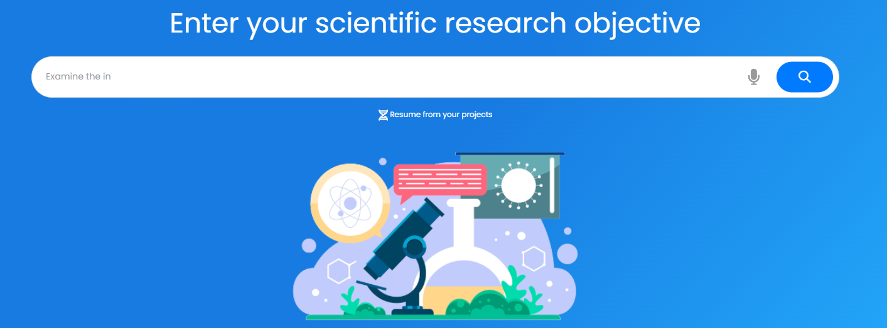
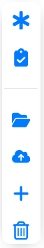
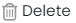

## **Aan de slag**

Om te beginnen met de functie __ES/IODE's SciScholarCraft__, voer je zo'n compleet en relevant mogelijke zin in over je wetenschappelijk onderzoeksdoel in de zoekbalk in het midden van de pagina.

SciScholarCraft zal je onderzoeksdoel analyseren en verschillende generatieacties voorstellen.

Meld je aan voor een gratis account om te profiteren van geavanceerde functies.

__ES/IODE__ staat voor je klaar om je te helpen bij je zoektocht naar wetenschappelijke kennis.

Neem gerust contact met ons op als je vragen of opmerkingen hebt.

Veel zoekplezier! :rocket:

## **Genereren van hypothesen**

Voor de functie "Genereren van hypothesen" moet je eerst een onderzoeksdoel invoeren in de zoekbalk en het resultaat van de SciScholarCraft-analyse verkrijgen.

Vervolgens heb je toegang tot de volgende sectie, onder analyse:

Klik vervolgens op de knop "Genereren van hypothesen", de generatieactie zal beginnen.

### **Kopieer generatie van hypothesen naar het klembord**

In het gedeelte met hypotheses, klik op het :fontawesome-solid-copy: icoon rechtsboven.

## **Selectie van wetenschappelijke studies**

Voor de functie "Selectie van wetenschappelijke studies" moet je eerst een onderzoeksdoel invoeren in de zoekbalk en het resultaat van de SciScholarCraft-analyse verkrijgen.

Vervolgens heb je toegang tot de volgende sectie, onder analyse:

Klik vervolgens op de knop "Selectie van wetenschappelijke studies", de generatieactie zal beginnen.

### **Kopieer wetenschappelijke studies naar het klembord**

In het gedeelte met wetenschappelijke studies, klik op het :fontawesome-solid-copy: icoon rechtsboven.

## **Genereren van schrijfplan**

Voor de functie "Genereren van schrijfplan" moet je eerst een onderzoeksdoel invoeren in de zoekbalk en het resultaat van de SciScholarCraft-analyse verkrijgen.

Vervolgens heb je toegang tot de volgende sectie, onder analyse:

Klik vervolgens op de knop "Genereren van schrijfplan", de generatieactie zal beginnen.

### **Exporteer genereren van schrijfplan naar Word**

In het gedeelte met het schrijfplan, klik op het :fontawesome-solid-file-export: icoon rechtsboven.

### **Kopieer genereren van schrijfplan naar het klembord**

In het gedeelte met het schrijfplan, klik op het :fontawesome-solid-copy: icoon rechtsboven.

## **Snelle toegangszijbalk**

!!! info
    De snelle toegangszijbalk is beschikbaar vanaf versie 3.2 van ES/IODE, het is beschikbaar op apparaten met een resolutie van meer dan **800px** breedte, zoals tablets, desktops en bepaalde mobiele apparaten in liggende modus.

De balk verschijnt na het genereren van de analyse van het SciScholarCraft-doel of direct na het openen van een bestaand project.

Het komt overeen met de onderstaande visual:

Het bevindt zich links van de generatiesections.

## **Selectie van onderzoeksproject**

!!! warning "aanmelden vereist"

    **Deze functie is alleen toegankelijk als je bent ingelogd met een account (aangemaakt op ons platform)**

Er zijn 2 mogelijkheden voor jou beschikbaar:

- Klik op het :fontawesome-solid-dna: icoon onder de zoekbalk

- Of klik op het :fontawesome-solid-folder-open: icoon in de snelle toegangszijbalk

Je kunt dan de lijst met jouw projecten bekijken (als je er al hebt opgeslagen).

## **Sla je project op**

!!! warning "aanmelden vereist"

    **Deze functie is alleen toegankelijk als je bent ingelogd met een account (aangemaakt op ons platform)**

!!! info

    In SciScholarCraft kun je tot 10 projecten opslaan.

Er zijn 2 mogelijkheden voor jou beschikbaar:

- Klik op de knop :fontawesome-solid-cloud-arrow-up: Opslaan, onder de generatiesections

- Als alternatief, klik op het :fontawesome-solid-cloud-arrow-up: icoon in de snelle toegangszijbalk

Een melding zal bevestigen of het project is opgeslagen.

## **Verwijder je project**

!!! warning "aanmelden vereist"

    **Deze functie is alleen toegankelijk als je bent ingelogd met een account (aangemaakt op ons platform)**

Er zijn 2 mogelijkheden voor jou beschikbaar:

1. Klik op het :fontawesome-solid-dna: icoon onder de zoekbalk, 
    1. Het menu **Selectie van onderzoeksprojecten** verschijnt. Klik vervolgens op de knop  op de regel van het project dat je wilt verwijderen.
    2. Het Actiemenu verschijnt; klik vervolgens op de knop .

2. Als alternatief, klik op het :fontawesome-solid-cloud-arrow-up: icoon in de snelle toegangszijbalk,
    1. Het menu **Selectie van onderzoeksprojecten** verschijnt, klik vervolgens op de knop  op de regel van het project dat je wilt verwijderen.
    2. Het Actiemenu verschijnt, klik vervolgens op de knop .

Een melding zal bevestigen of het project is verwijderd.

## **Open je project**

!!! warning "aanmelden vereist"

    **Deze functie is alleen toegankelijk als je bent ingelogd met een account (aangemaakt op ons platform)**

Er zijn 2 mogelijkheden voor jou beschikbaar:

1. Klik op het :fontawesome-solid-dna: icoon onder de zoekbalk, 
    1. Het menu **Selectie van onderzoeksprojecten** verschijnt. Klik vervolgens op de knop  op de regel van het project dat je wilt openen.
    2. Het Actiemenu verschijnt; klik vervolgens op de knop .

2. Als alternatief, klik op het :fontawesome-solid-cloud-arrow-up: icoon in de snelle toegangszijbalk,
    1. Het menu **Selectie van onderzoeksprojecten** verschijnt, klik vervolgens op de knop  op de regel van het project dat je wilt openen.
    2. Het Actiemenu verschijnt, klik vervolgens op de knop .

## **Nieuw project**

!!! warning "aanmelden vereist"

    **Deze functie is alleen toegankelijk als je bent ingelogd met een account (aangemaakt op ons platform)**

Klik op het :fontawesome-solid-plus: icoon in de snelle toegangszijbalk.

