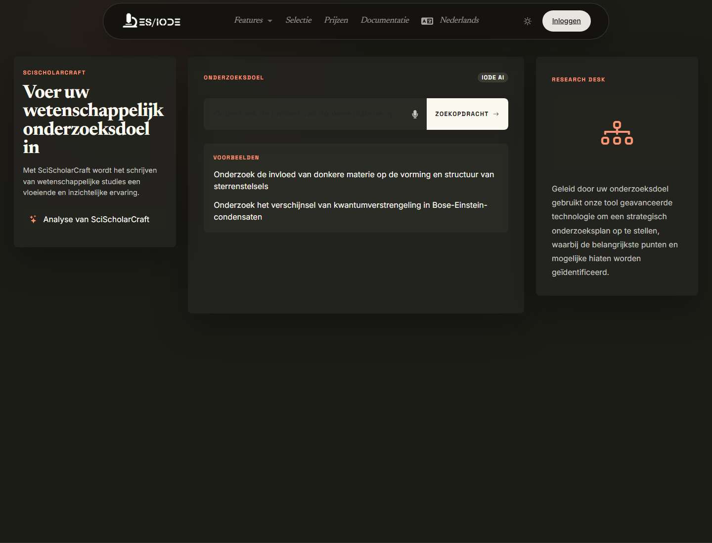

# **SciScholarCraft**

SciScholarCraft ondersteunt het structureren van een wetenschappelijk onderzoeksdoel. Het helpt om van een brede intentie naar werkbare richtingen te gaan: hypothesen, studieselectie, schrijfplan en projectorganisatie wanneer het actieve aanbod dit mogelijk maakt.

```text
https://ethicseido.com/Iode/SciScholarCraft
```



## Een onderzoeksdoel formuleren

De kwaliteit van de output hangt sterk af van de startformulering. Gebruik bij voorkeur een volledige zin met vakgebied, studieobject, populatie of systeem, te analyseren relatie en gewenste output.

```text
Beoordeel de rol van neuro-inflammatie in de vroege progressie van de ziekte van Alzheimer en identificeer biomarkers die bruikbaar zijn voor een narratieve review.
```

Vermijd te korte of dubbelzinnige vragen. Bij brede onderwerpen kun je exploratief starten en verfijnen op basis van voorgestelde hypothesen of studies.

## Generatieacties

Na de analyse wordt de taaksectie beschikbaar. Er kan slechts één generatieactie tegelijk worden gestart.

- **Hypothesen genereren**: produceert werkhypothesen om te onderzoeken, verwerpen of preciseren.
- **Wetenschappelijke studies selecteren**: stelt studies voor om een eerste corpus op te bouwen.
- **Schrijfplan genereren**: structureert een wetenschappelijke argumentatie, bijvoorbeeld voor review, introductie of protocol.

Elke generatie is een structurerende hulp, geen definitief resultaat. Hypothesen moeten met literatuur en beschikbare gegevens worden vergeleken.

## Wetenschappelijk gebruik

SciScholarCraft is nuttig om onderzoeksvragen te verduidelijken, subthema's te vinden, een artikel- of rapportstructuur voor te bereiden, theoretische invalshoeken te vergelijken en lacunes in een corpus zichtbaar te maken.

## Projecten en opslaan

!!! warning "Academic-aanbod vereist"
    Projectfuncties zoals opslaan, openen, verwijderen of maken van een project vereisen aanmelden en het Academic-aanbod wanneer ze niet openbaar beschikbaar zijn.

## Validatie

Controleer voor academisch werk altijd primaire referenties, studiemethoden, mogelijke bias en consistentie tussen hypothesen, data en conclusie.
